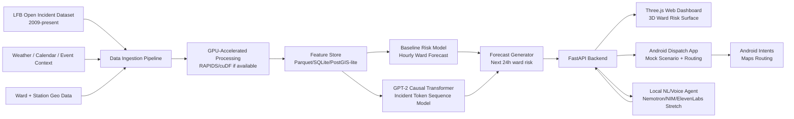
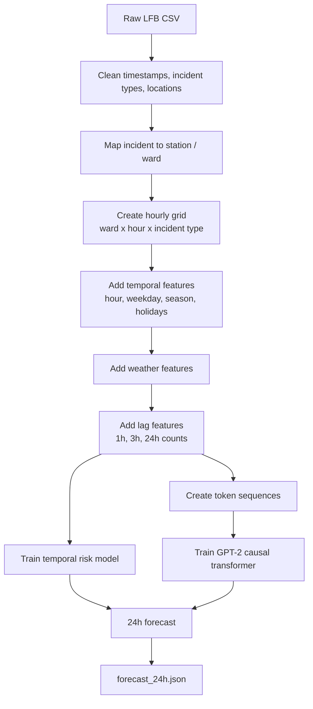
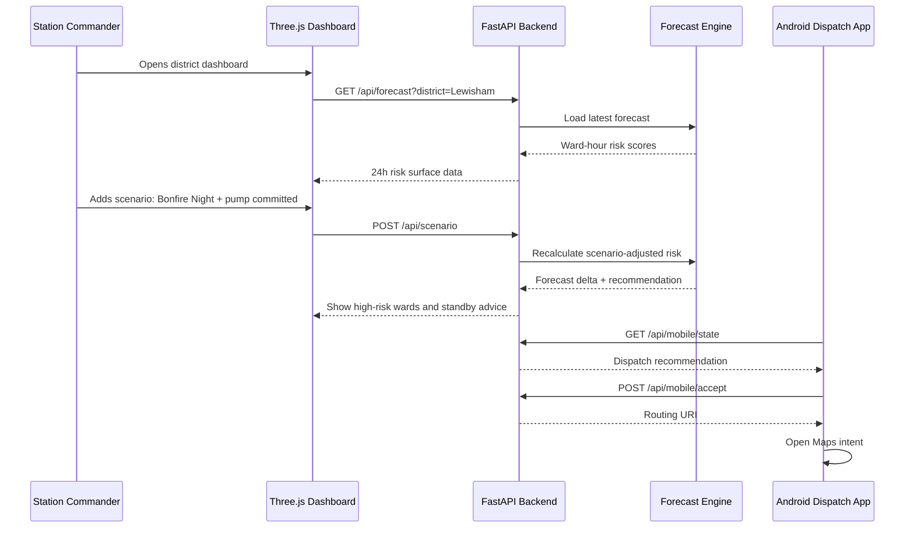
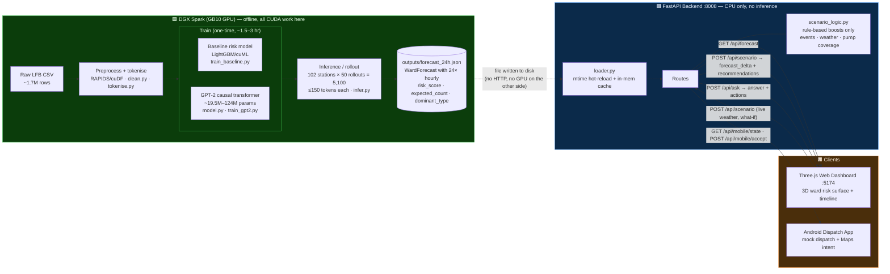

# Foresight for Fires

A locally-running spatiotemporal **decision-support system** for London Fire Brigade operations, inspired by the NHS Foresight AI project (Kraljevic et al., *Lancet Digital Health* 2024). We treat each fire station's call history as a token sequence and train a GPT-2 scale causal language model from scratch to learn the statistical rhythm of London's fire incidents, producing a dynamic ward-level risk surface for the next 24 hours — exposed through a 3D web dashboard, an Android mock-dispatch app, and a local natural-language assistant.

Built at **NVIDIA Hack London**. Track: **Urban Operations**. Runs entirely on **DGX Spark** — no cloud exposure.

> **Pitch:** Foresight for Fires ingests open LFB incident data, builds hourly ward-level risk forecasts, and lets commanders test operational scenarios such as pump shortages, weather changes, or Bonfire Night conditions. The web dashboard renders a 3D risk surface over London wards; the Android app turns model recommendations into mock dispatch actions and routing intents. Sensitive live operational data never leaves the box.

---

## Project Overview

Rather than predicting individual fires (which is noise), the model learns the **intensity function** — the expected rate of incidents per ward per unit time — as a function of historical patterns, weather, and calendar context. Sampling many forward rollouts from the trained model gives a probabilistic 24-hour heatmap over London's wards, rendered as an interactive Three.js 3D surface.

A natural-language interface on top lets a station commander query the system in plain English. The high-value framing for judges:

> "We help commanders decide where scarce standby resources should be positioned when local coverage is degraded" — **not** "we predict fires."

### Two-model strategy

The build runs **two models in parallel** so the demo is never blocked on the research model:

1. **Level 1 — Baseline risk model (reliable, build first).** Hourly ward-level count/risk forecast from tabular features (time, calendar, weather, lag counts). LightGBM / cuML / PyTorch MLP / Poisson. This is the demo fallback.
2. **Level 2 — Token-sequence GPT-2 model (innovative, build after baseline works).** Incident history as "a language of urban emergencies." Adds technical depth and the headline story.

> **Innovation story:** station histories become token sequences containing incident type, location, time gap, weather, and calendar context. In the MVP we combine this with a robust hourly risk model so the system stays reliable under hackathon constraints.

---

## Is GPT-2-from-scratch realistic on DGX Spark? (Yes)

**Short answer: yes, and it's compute-cheap — the limit is data, not the GPU.**

| Quantity | Value |
|---|---|
| Corpus size | ~35M tokens (≈1.7M incidents × ~10–15 tokens each) |
| Model | GPT-2 small, 124M params (12 layers, 768 hidden) |
| Train FLOPs / epoch | 6 · N · D = 6 · 124M · 35M ≈ **2.6 × 10¹⁶ FLOP** |
| DGX Spark (GB10) sustained BF16 | ~50–100 TFLOP/s realistic |
| **Time per epoch** | **~5–9 minutes** |
| **Full training (15–20 epochs)** | **~1.5–3 hours** |
| Peak memory (model + Adam + activations, bf16) | < 10 GB — trivial vs. 128 GB unified |

**Interpretation:**
- The 128 GB coherent unified memory means model, optimizer state, the full tokenised corpus, and the geospatial pipeline all stay resident on one machine — no offloading.
- 35M tokens is *small* for a 124M model (Chinchilla-optimal would want ~2.5B tokens). You are **data-limited**, so you train multiple epochs and watch for overfit, rather than fighting compute.
- **Recommendation:** if the rest of the system isn't done yet, do **not** chase full GPT-2. Train a small causal transformer (4–6 layers, 256–512 hidden, seq len 128–512) — minutes per epoch — and only scale up to full GPT-2 small once the end-to-end demo is green. Both fit comfortably in the time budget.

DGX Spark's official spec: local AI software stack, NIM support, 128 GB unified memory; suited to AI agents, fine-tuning up to 70B, inference up to 200B, and data science. ([NVIDIA](https://www.nvidia.com/en-us/products/workstations/dgx-spark/))

---

## Data Sources

| Dataset | Source | Licence |
|---|---|---|
| LFB Incident Records 2009–present (~1.7M rows) | [London Datastore](https://data.london.gov.uk/dataset/london-fire-brigade-incident-records-em8xy/) | OGL v3 |
| Met Office MIDAS Open hourly weather | [CEDA Archive](https://catalogue.ceda.ac.uk) | OGL v3 |
| Index of Multiple Deprivation 2019 | [London Datastore](https://data.london.gov.uk) | OGL v3 |
| ONS Census 2021 LSOA tables | [ONS](https://www.ons.gov.uk) | OGL v3 |
| LFB Bonfire/Diwali/Halloween incident records | [London Datastore](https://data.london.gov.uk/dataset/incidents-occuring-around-diwali-halloween---bonfire-night/) | OGL v3 |

---

## Team Split

Three people, ~24 hours, 72 person-hours. **No one blocks anyone.** Person B ships a fake forecast immediately so frontend and Android are never waiting on the model. Each member has a detailed brief:

| Person | Role | Brief |
|---|---|---|
| **A** | Model / Data Lead | [`docs/PERSON_A_model_data.md`](docs/PERSON_A_model_data.md) |
| **B** | Backend + Web Frontend Lead | [`docs/PERSON_B_backend_web.md`](docs/PERSON_B_backend_web.md) |
| **C** | Android + Dispatch / Voice Lead | [`docs/PERSON_C_android_voice.md`](docs/PERSON_C_android_voice.md) |

**Hard rule:** the API contract is locked at Hour 2 and does not change unless all three agree.

---

## Scheme of Work (model track)

```
Phase 0  Setup & environment                          ~30 min
Phase 1  Data cleaning                                ~1.5 hr
Phase 2  Tokenisation scheme                          ~1 hr
Phase 3  Windowing & dataset construction             ~30 min
Phase 4  Model definition & training                  ~1.5 hr (+ ~1.5-3 hr training time)
Phase 5  Inference & risk surface generation          ~1 hr
Phase 6  Evaluation                                   ~30 min
Phase 7  Three.js frontend (parallel from Phase 0)    ~3 hr
```

---

## Phase 1: Data Cleaning

This phase is the foundation for everything downstream. The tokenisation scheme, model vocabulary, and evaluation pipeline all depend on a clean, consistent dataframe. Lock this down before moving to Phase 2.

### 1.1 Raw Schema

The raw CSV has 38 columns. The fields we use and their known issues:

| Field | Use | Known Issues |
|---|---|---|
| `IncidentNumber` | Unique row ID | Some duplicates — drop |
| `DateOfCall` | Datetime base | Format `%d-%b-%y`, two-digit year |
| `TimeOfCall` | Datetime base | Combine with `DateOfCall` |
| `HourOfCall` | Derived feature | Redundant once datetime is parsed — keep as sanity check |
| `IncidentGroup` | Token: `GROUP` | 3 values: Fire, Special Service, False Alarm |
| `StopCodeDescription` | Token: `STOP` | ~8 values, e.g. Primary Fire, AFA, False Alarm Good Intent |
| `SpecialServiceType` | Token: `SVCTYPE` | ~20 values, only populated when `IncidentGroup = Special Service` |
| `PropertyCategory` | Token: `PROP` | 9 values — use this, not `PropertyType`, for v1 |
| `PropertyType` | Reference only | Hundreds of values with trailing whitespace — strip but defer |
| `IncGeo_BoroughName` | Token: `BOROUGH` | Clean, 33 values |
| `IncGeo_WardNameNew` | Token: `WARD` | Use this not `IncGeo_WardName` — accounts for 2018 boundary change |
| `Easting_rounded` / `Northing_rounded` | Spatial fallback | 50m BNG, always present; lat/long redacted for dwellings |
| `Latitude` / `Longitude` | Spatial (non-dwellings) | Null for ~53% of fire incidents (dwelling privacy redaction) |
| `IncidentStationGround` | Sequence key | 102 values — this is the "patient ID" |
| `FirstPumpArriving_AttendanceTime` | Feature | Seconds, some nulls |
| `NumPumpsAttending` | Feature | Integer |
| `NumCalls` | Feature | Integer |

### 1.2 Cleaning Steps

Run these in order. Each step has a validation check — do not skip these, as silent errors here corrupt the entire pipeline.

**Step 1: Load and inspect**
```python
import pandas as pd

df = pd.read_csv("lfb_incidents.csv", dtype=str, low_memory=False)
print(df.shape)           # expect ~1.7M rows, 38 cols
print(df.dtypes)
print(df.head(3))
```

Load everything as strings initially so that literal `"NULL"` values are visible before coercion.

**Step 2: Replace literal nulls**
```python
df.replace("NULL", pd.NA, inplace=True)
df.replace("", pd.NA, inplace=True)
```

Literal `"NULL"` strings appear throughout the raw data and will silently persist as valid categorical values if not caught here.

**Step 3: Parse datetime**
```python
df["datetime"] = pd.to_datetime(
    df["DateOfCall"].str.strip() + " " + df["TimeOfCall"].str.strip(),
    format="%d-%b-%y %H:%M:%S"
)
df = df.sort_values("datetime").reset_index(drop=True)
```

Validate:
```python
assert df["datetime"].isna().sum() == 0, "Unparsed datetimes"
assert df["datetime"].min().year == 2009
assert df["datetime"].max().year >= 2024
```

**Step 4: Strip whitespace from categoricals**
```python
cat_cols = [
    "IncidentGroup", "StopCodeDescription", "SpecialServiceType",
    "PropertyCategory", "PropertyType", "IncGeo_BoroughName",
    "IncGeo_WardNameNew", "IncidentStationGround"
]
for col in cat_cols:
    df[col] = df[col].str.strip()
```

`PropertyType` is the main offender (`"Car "`, `"Lake/pond/reservoir "`).

**Step 5: Drop duplicates**
```python
before = len(df)
df = df.drop_duplicates(subset="IncidentNumber", keep="first")
print(f"Dropped {before - len(df)} duplicate IncidentNumbers")
```

**Step 6: Cast numeric fields**
```python
numeric_cols = [
    "HourOfCall", "Easting_m", "Northing_m",
    "Easting_rounded", "Northing_rounded",
    "FirstPumpArriving_AttendanceTime", "NumPumpsAttending",
    "NumStationsWithPumpsAttending", "NumCalls",
    "PumpMinutesRounded", "Notional Cost (£)"
]
for col in numeric_cols:
    df[col] = pd.to_numeric(df[col], errors="coerce")
```

**Step 7: Canonical geography**

Use `IncGeo_WardNameNew` throughout. Where missing, fall back to `IncGeo_BoroughName`. Log the fallback rate.
```python
df["ward_canonical"] = df["IncGeo_WardNameNew"].fillna(
    df["IncGeo_BoroughName"].apply(lambda x: f"BOROUGH:{x}" if pd.notna(x) else pd.NA)
)
fallback_rate = df["ward_canonical"].isna().mean()
print(f"Ward fallback rate: {fallback_rate:.2%}")  # expect <2%
```

**Step 8: Regime flags**

The data contains two structural breaks that the model must account for, otherwise temporal patterns around these dates will appear as noise.

```python
df["post_station_remap"] = (df["datetime"] >= "2014-01-10").astype(int)
df["post_grenfell"]      = (df["datetime"] >= "2017-06-14").astype(int)
```

These become static prefix tokens in the sequence.

**Step 9: Validate station coverage**
```python
station_counts = df.groupby("IncidentStationGround").size().sort_values()
print(station_counts.describe())
# expect min ~5000, median ~15000, max ~30000 across 102 stations
assert station_counts.min() > 1000, "Suspiciously low count for a station"
```

**Step 10: Temporal train/test split**

Hold out 2025 entirely as the test set. This ensures evaluation is genuinely forward-looking.
```python
df_train = df[df["datetime"] < "2025-01-01"].copy()
df_test  = df[df["datetime"] >= "2025-01-01"].copy()
print(f"Train: {len(df_train):,}  |  Test: {len(df_test):,}")
```

**Step 11: Save cleaned output**
```python
df_train.to_parquet("data/lfb_train_clean.parquet", index=False)
df_test.to_parquet("data/lfb_test_clean.parquet", index=False)
```

Parquet preserves dtypes, loads ~10x faster than CSV, and halves file size.

### 1.3 Validation Checklist

Before moving to Phase 2, confirm all of the following:

- [ ] No literal `"NULL"` strings remain in any column
- [ ] `datetime` is parsed for all rows with zero nulls
- [ ] 102 unique values in `IncidentStationGround`
- [ ] 33 unique values in `IncGeo_BoroughName`
- [ ] No trailing whitespace in any categorical field
- [ ] Duplicate `IncidentNumber` rows removed
- [ ] `df_train` ends before 2025-01-01, `df_test` starts from 2025-01-01
- [ ] Both parquet files written successfully

---

## Phase 2: Tokenisation Scheme

The vocabulary covers five token families: `GAP`, `GROUP`, `STOP`, `PROP`, `WARD`, plus context prefix tokens for weather and calendar. Each incident maps to roughly 10–15 tokens; the full corpus is approximately 35M tokens.

Example incident-sequence encoding (one station's stream):

```text
<WEATHER_RAIN_HEAVY> <TEMP_COLD> <DOW_FRI> <HOUR_18>
<STATION_LEWISHAM> <WARD_E05009317> <TYPE_DWELLING_FIRE> <DT_30MIN>
<STATION_LEWISHAM> <WARD_E05009321> <TYPE_FALSE_ALARM> <DT_2H>
...
```

Training objective: **predict the next incident token sequence** (standard causal LM). Sampling forward rollouts → convert sampled incidents into ward-hour risk scores.

See [`docs/PERSON_A_model_data.md`](docs/PERSON_A_model_data.md) for the full token grammar, windowing, model config, and evaluation plan.

---

## System Architecture



### Data pipeline



### Runtime sequence



### DGX Spark handoff — what crosses the GPU boundary

The only thing the DGX Spark hands to the rest of the system is a single file: `outputs/forecast_24h.json`. All GPU work (preprocessing, training, rollout inference) happens **offline** on the Spark; the backend and frontend never touch CUDA. The handoff is a plain file the backend hot-reloads on `mtime` change — DGX overwrites the JSON, the next API request serves it with no restart and no code change.



**Handoff contract (the artifact):**

| Producer | Artifact | Consumer | Mechanism | Timing |
|---|---|---|---|---|
| DGX Spark (`infer.py`) | `outputs/forecast_24h.json` | Backend (`loader.py`) | File on disk, `mtime` hot-reload | Training ~1.5–3 hr (one-time); inference rollout produces the JSON per refresh |
| Backend (`routes/*`) | JSON over HTTP `:8008` | Web `:5174` + Android | FastAPI / REST | Per request (read-only, ms) |
| Backend (`scenario_logic.py`) | `forecast_delta` + recommendations | Web + Android | Rule-based, no GPU | Per request (deterministic, ms) |

> **Key design point for judges:** the GPU boundary is a single JSON file. The Spark can be busy training for hours while the live demo keeps serving the last-good forecast. Swapping fake data for the real model is a zero-code file swap — both conform to the same `WardForecast` schema.

---

## Shared Data Contracts

These TypeScript types are the **single source of truth** across all three tracks. Locked at Hour 2.

```typescript
type ForecastPoint = {
  ward_id: string;
  ward_name: string;
  district?: string;
  station_area?: string;
  lat: number;
  lon: number;
  hour: number;
  timestamp: string;
  incident_type: string;
  risk_score: number;       // 0 to 1
  expected_count: number;   // predicted count
  uncertainty?: number;
};

type Recommendation = {
  recommendation_id: string;
  action: "pre_position" | "hold" | "dispatch" | "monitor";
  priority: number;
  from_station?: string;
  to_ward?: string;
  destination_lat?: number;
  destination_lon?: number;
  resource?: string;
  reason: string;
  confidence: number;
};

type Scenario = {
  district: string;
  time: string;
  weather: { rain?: string; wind?: string; temperature?: number };
  events?: string[];
  pump_availability: Record<string, number>;
  ongoing_incidents: { ward: string; type: string; pumps_committed: number }[];
};
```

Full request/response examples for every endpoint live in the per-person docs.

---

## API Endpoints (summary)

| Method | Path | Owner | Purpose |
|---|---|---|---|
| `GET` | `/health` | B | Liveness + model/device status |
| `GET` | `/api/forecast?district=&incident_type=` | B | 24h ward risk surface |
| `POST` | `/api/scenario` | B | Scenario-adjusted forecast + recommendations |
| `POST` | `/api/ask` | B/C | Natural-language query → answer + actions |
| `GET` | `/api/mobile/state?station=` | C | Dispatch state for Android |
| `POST` | `/api/mobile/accept` | C | Accept recommendation → routing URI |

---

## Recommended Technical Stack

**Model/Data:** Python, pandas/polars, RAPIDS cuDF (if available), PyTorch (CUDA), scikit-learn fallback, Parquet, GeoPandas.
**Backend:** FastAPI, Uvicorn, Pydantic, SQLite/DuckDB, Parquet.
**Web:** React, Vite, Three.js, MapLibre (optional), Tailwind (optional).
**Android:** Kotlin, Jetpack Compose, Retrofit/Ktor, Maps intent, SpeechRecognizer, TextToSpeech.

**NVIDIA scoring angle:** RAPIDS/cuDF for accelerated preprocessing + PyTorch CUDA for training/inference is the realistic baseline; add NIM/Nemotron for the local NL assistant to go stronger. Emphasise local inference and operational-data privacy.

---

## Repository Structure

```text
foresight-for-fires/
├── README.md
├── DEMO_SCRIPT.md
├── run_all.sh
├── docs/
│   ├── PERSON_A_model_data.md
│   ├── PERSON_B_backend_web.md
│   └── PERSON_C_android_voice.md
├── data/
│   ├── raw/                  # original LFB CSV download
│   ├── lfb_train_clean.parquet
│   ├── lfb_test_clean.parquet
│   ├── processed/
│   ├── geo/                  # ward + station geometry
│   └── weather/              # MIDAS joined data
├── model/  (a.k.a. src/)
│   ├── clean.py              # Phase 1 cleaning pipeline
│   ├── tokenise.py           # Phase 2 tokenisation
│   ├── dataset.py            # Phase 3 windowing and DataLoader
│   ├── train_baseline.py     # Level 1 baseline risk model
│   ├── model.py              # Phase 4 GPT-2 config and training
│   ├── infer.py              # Phase 5 rollout and risk surface
│   ├── generate_forecast.py  # writes forecast_24h.json
│   └── eval.py               # Phase 6 precision@K and PAI
├── backend/
│   ├── main.py
│   ├── schemas.py
│   └── routes/
│       ├── forecast.py
│       ├── scenario.py
│       ├── mobile.py
│       └── ask.py
├── frontend/
│   ├── package.json
│   └── src/
│       ├── App.tsx
│       ├── api.ts
│       └── components/
│           ├── RiskMap3D.tsx
│           ├── TimelineScrubber.tsx
│           └── ScenarioPanel.tsx
├── android/
│   └── app/
├── notebooks/
│   └── 01_eda.ipynb
└── outputs/
    ├── forecast_24h.json
    ├── scenario_demo.json
    └── demo_logs/
```

---

## 24-Hour Execution Plan

| Phase | Hours | Goal |
|---|---|---|
| 1 | 0–2 | **Lock interfaces.** Agree forecast/scenario schema, routes, folders, demo district (Lewisham), demo scenario (Bonfire Night + pump shortage + high wind). B ships a fake `forecast_24h.json` so no one is blocked. |
| 2 | 2–8 | **Parallel MVP.** A: data→baseline→forecast JSON. B: FastAPI + React + 3D surface on fake data. C: Android app on fake backend. |
| 3 | 8–14 | **Integration.** A swaps in real forecast. B connects to real `/api/forecast` + scenario delta. C connects to real `/api/mobile/state` + scenario buttons. |
| 4 | 14–18 | **NVIDIA/Spark depth.** A adds RAPIDS/cuDF or CUDA PyTorch or NIM `/api/ask`. B adds "Running locally on DGX Spark" status panel. C adds voice/TTS. |
| 5 | 18–21 | **Polish demo path.** One scripted end-to-end run; screenshots + backup video. |
| 6 | 21–24 | **Stability + story.** One-command startup, no crashes, pre-generated forecast fallback, `DEMO_SCRIPT.md`, README, scoring explanation. |

---

## Judging Criteria Mapping

| Criterion | Pts | Our story |
|---|---|---|
| Technical Execution & Completeness | 30 | Full local data-to-decision pipeline: raw LFB → GPU preprocessing → model training → 24h ward risk → 3D web viz → mobile dispatch. |
| NVIDIA Ecosystem & Spark Utility | 30 | RAPIDS/cuDF preprocessing + PyTorch CUDA training + (stretch) NIM/Nemotron assistant. 128GB unified memory keeps model + geo + agent resident; operational data stays local. |
| Value & Impact | 20 | Where to pre-position scarce standby resources when local coverage is degraded. Top-5 wards at risk, risk increase from pump commitment, recommended standby, driving incident type, confidence. |
| Innovation & Execution | 20 | Incident history as a language; dynamic ward risk surface; scenario-conditioned planning; mobile dispatch loop; local voice assistant. |

---

## What to Cut If Time Is Tight

**Cut first:** full GPT-2-from-scratch training (fall back to small transformer or baseline), high-res London geometry, complex weather API, real-time live data, perfect routing optimisation.

**Keep no matter what:** working forecast JSON, backend API, 3D risk surface, scenario input, mobile recommendation, NVIDIA/Spark explanation, end-to-end demo.

> Judges reward functioning systems. A simple model inside a complete system beats an impressive model with no usable interface.

---

## Final MVP Checklist

```text
[ ] Raw or processed LFB data loads locally
[ ] Forecast generated for next 24 hours
[ ] Forecast includes ward, hour, incident type, risk score
[ ] Backend serves forecast
[ ] Web dashboard renders risk surface
[ ] Timeline scrubber works
[ ] Scenario panel changes forecast/recommendation
[ ] Android app displays recommendation
[ ] Android app opens routing intent
[ ] At least one NVIDIA component used
[ ] Spark/privacy/local-inference story is clear
[ ] Demo can run without internet
[ ] Backup forecast JSON exists
[ ] Backup demo video/screenshots exist
```

---

## Environment

```
python >= 3.10
torch >= 2.3
transformers >= 4.40
pandas >= 2.2
pyarrow
scikit-learn
matplotlib
fastapi
uvicorn
```

On DGX Spark, use the NVIDIA PyTorch container as the base:
```bash
docker pull nvcr.io/nvidia/pytorch:24.04-py3
```
