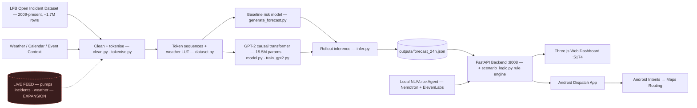
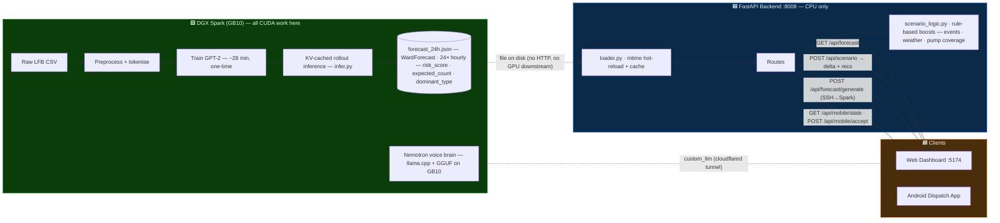

# Foresight for Fires

A locally-running spatiotemporal **decision-support system** for London Fire Brigade operations, inspired by the NHS Foresight AI project (Kraljevic et al., *Lancet Digital Health* 2024). We treat each fire station's call history as a token sequence and train a GPT-2 scale causal language model from scratch to learn the statistical rhythm of London's fire incidents, producing a dynamic ward-level risk surface for the next 24 hours — exposed through a 3D web dashboard, an Android mock-dispatch app, and a local natural-language voice assistant.

Built at **NVIDIA Hack London**. Track: **Urban Operations**. Runs entirely on **DGX Spark** — no cloud exposure of operational data.

> **What it is for.** Foresight is a **training, planning, and readiness tool** today, and a **real-time dispatch tool** the moment it is plugged into a live feed. As a planning tool it lets commanders rehearse operational scenarios — pump shortages, weather swings, Bonfire Night — and *estimate readiness* before a shift: "if these three pumps are committed at 20:00, which wards lose cover, and where should standby go?" The same engine, fed live pump availability and active incidents instead of replayed history, becomes a real-time dispatch advisor that learns from what actually happens.

> "We help commanders decide where scarce standby resources should be positioned when local coverage is degraded" — **not** "we predict fires."

---

## Two modes, one engine

Foresight runs on the same model, schema, and UI in both modes. The only thing that changes is the data source feeding the forecast.

| | **Mode 1 — Training & Readiness** (today) | **Mode 2 — Real-Time Operations** (expansion) |
|---|---|---|
| **Input** | Historical LFB data + replayed/what-if conditions (weather, events, pump availability) | Live CAD/incident feed, live pump status, live weather |
| **Use** | Drill scenarios, estimate shift readiness, rehearse degraded-coverage response, train new commanders | Continuous pre-positioning advice, live dispatch support, faster response |
| **Loop** | Batch retrain on the latest open dataset | Continuous learning from real outcomes as they stream in |
| **What runs** | Exactly the code in this repo | Same code; swap the JSON producer for a live ingestor (see [Roadmap](#roadmap-from-drills-to-live-dispatch)) |

The whole architecture is deliberately built so that **Mode 2 is a data-source swap, not a rewrite** — the GPU boundary is a single JSON file (see [DGX Spark handoff](#dgx-spark-handoff--what-crosses-the-gpu-boundary)).

---

## Use Case 1 — Training exercises & readiness estimation

This is what the system does **right now**, end to end, with no live feed required.

- **Scenario rehearsal.** Pose a what-if — Bonfire Night at 20:00, a storm, two pumps committed in Lewisham — and the system recomputes a scenario-adjusted risk surface plus concrete pre-position recommendations. Backend `scenario_logic.py` applies event/weather/coverage boosts and returns a per-ward `forecast_delta` and ranked actions (`pre_position` from the nearest station with spare pumps, or `monitor` if none).
- **Readiness estimation.** The coverage penalty (`×1.4` when no spare pump is near a high-uplift ward) makes degraded coverage *visible*: you can see which wards go uncovered under a given commitment before committing.
- **Generate any day on the Spark.** From the dashboard or by voice, generate a fresh 24h forecast for any date/hour/weather combination (`generate_day` voice tool → `POST /api/forecast/generate` → GPT-2 rollouts on the Spark → new surface in ~1–2 min). Replay last Bonfire Night; rehearse a heatwave.
- **Time-scrubbed walkthrough.** The 24h timeline scrubber (0.25×–4× playback) lets an instructor walk a crew through how risk builds and shifts across a day.
- **Voice-driven briefing.** The ElevenLabs assistant turns the surface into a spoken brief — rank hotspots, compare wards, focus the camera, scrub time — useful for hands-free table-top exercises and shift handover.

Because everything runs locally on one box, it doubles as a **safe sandbox**: no live operational data is required to train people on the tool.

---

## Use Case 2 — Real-time dispatch (the expansion path)

The same engine, fed a **live data feed instead of replayed history**, becomes an operational dispatch advisor:

- **Real-time pre-positioning.** Live pump availability + active incidents flow into the same scenario engine that already accepts `pump_availability` and `ongoing_incidents` — turning rehearsed advice into live standby recommendations.
- **Timelier response.** Sub-second scenario deltas mean a commander sees the coverage impact of a commitment the instant it happens, not after.
- **Continuous learning.** Real incident outcomes feed back into batch retraining, so the model improves on the actual distribution of the brigade it serves — not just the open historical record.
- **Privacy by construction.** This is exactly why it runs on DGX Spark: the high-value live data (active incidents, pump status) **never leaves the brigade's box**. Cloud was never the plan.

See [Roadmap](#roadmap-from-drills-to-live-dispatch) for what wiring this up concretely requires (it is small — the seams already exist).

---

## Quick Start

### Prerequisites

```
python >= 3.10
node >= 18
torch >= 2.3  (CUDA recommended — DGX Spark GB10 used for training/inference)
```

Install Python dependencies:
```bash
pip install -r backend/requirements.txt   # FastAPI, Uvicorn, Pydantic, numpy, etc.
```

Install frontend dependencies:
```bash
cd frontend && npm install
```

### One command (recommended)

```bash
./run_all.sh
```

This activates the venv, installs backend deps, writes a fallback forecast if none exists (`backend.fake_forecast`), starts the **backend on `:8008`**, and the **Vite frontend on `:5174`** (Vite proxies `/api` + `/health` → `:8008`). Ports are 8008/5174 because a local Docker stack squats 8000/5173.

A pre-generated `outputs/forecast_24h.json` is committed, so the stack renders real model output immediately without a GPU.

### Manual startup

```bash
# 1. (Optional, needs GPU) regenerate the forecast — produces outputs/forecast_24h.json
python -m src.infer
python -m src.infer --date 2024-11-05 --hour 18          # specific date/time
python -m src.infer --temp 2.0 --rain 5.0 --wind 35      # weather scenario
python -m src.infer --n-rollouts 20 --max-new-tokens 150  # sampling knobs

# 2. backend
uvicorn backend.main:app --host 0.0.0.0 --port 8008 --reload   # verify: curl localhost:8008/health

# 3. frontend
cd frontend && npm run dev    # http://localhost:5174
```

### Android app

Open `android/` in Android Studio, let Gradle sync, hit **Run**. Or via CLI:

```bash
cd android
./gradlew :app:assembleDebug
./gradlew :app:installDebug
```

The app tries `http://10.0.2.2:8008` (emulator → host loopback) then a hard-coded LAN IP, first success wins — one APK works on emulator and a real phone. Edit the base URLs in `MainActivity.kt` (`WebBridge`) for your network.

---

## Environment Variables

```bash
cp frontend/.env.example frontend/.env
cp elevenlabs/.env.example elevenlabs/.env
```

| File | Variable | Purpose |
|---|---|---|
| `frontend/.env` | `VITE_API_URL` | Backend URL (leave unset in dev — Vite proxy handles it) |
| `frontend/.env` | `VITE_ELEVENLABS_AGENT_ID` | ElevenLabs agent id for the web voice console |
| `elevenlabs/.env` | `ELEVENLABS_API_KEY` | ElevenLabs API key |
| backend env | `NEMOTRON_URL`, `NEMOTRON_MODEL`, `NEMOTRON_TIMEOUT_S` | Optional: ground `/api/ask` answers in a local Nemotron LLM (rule engine is the offline-safe fallback) |
| backend env | `SPARK_HOST`, `SPARK_USER`, `SPARK_REPO` | DGX Spark target for live forecast generation over SSH (defaults to `scan-02.local`) |

The web voice agent works in read-only mode without a key; live conversation needs one.

---

## How it works

Rather than predicting individual fires (which is noise), the model learns the **intensity function** — the expected rate of incidents per ward per unit time — as a function of historical patterns, weather, and calendar context. Sampling many forward rollouts from the trained model gives a probabilistic 24-hour heatmap over London's wards, rendered as an interactive Three.js 3D surface.

The DGX Spark carries **two** GPU workloads at once, both on the one GB10 box — and its 128 GB unified memory is what lets them stay resident together:

1. **The forecast model** — trains the GPT-2 transformer and runs rollout inference to produce `outputs/forecast_24h.json`.
2. **The Nemotron voice brain** — serves NVIDIA Nemotron-3-Nano locally (llama.cpp + GGUF, all layers on the GPU) as the LLM behind the ElevenLabs voice agent, reached over a cloudflared tunnel as a `custom_llm`.

So the Spark is not just a one-shot forecast producer — it is also the always-on inference server for the natural-language assistant. Both the predictive model and the conversational reasoning run on-box, so no operational data leaves the machine for either path.

### Architecture — four layers

1. **DGX Spark (GPU)** — runs both GPU workloads above: (a) data preprocessing, model training (19.5M-param GPT-2 small, ~28 min on GB10), and KV-cached Monte Carlo rollout inference (102 stations × rollouts) producing `outputs/forecast_24h.json`; and (b) the persistent Nemotron-3-Nano voice brain that powers the assistant.
2. **FastAPI backend (CPU only)** — hot-reloads the JSON on `mtime` change; serves forecast, scenario, mobile, ask, and live-generate routes; no CUDA dependency.
3. **Three.js web dashboard** — 3D ward risk surface over a real London basemap + OSM buildings, timeline scrubber, scenario/generate panel, ElevenLabs voice agent.
4. **Android dispatch app** — Kotlin + WebView shell; Station tab (recommendation → Accept → Maps routing), Globe tab (3D risk), Assistant tab (ElevenLabs voice).



### DGX Spark handoff — what crosses the GPU boundary

The DGX Spark hands off a single file to the rest of the system: `outputs/forecast_24h.json`. All GPU work (preprocessing, training, rollout inference) happens **on the Spark**; the backend and frontend never touch CUDA. The backend hot-reloads the JSON on `mtime` change — the Spark overwrites the file, the next API request serves it with no restart and no code change.

This is the design point that makes the real-time expansion cheap: **swapping replayed data for a live feed is a zero-code file swap** — both producers conform to the same `WardForecast` schema. The backend can also trigger generation on demand: `POST /api/forecast/generate` SSHes into the Spark, runs `src.infer`, and `scp`s the fresh JSON back (job-polled via `GET /api/forecast/generate/{job_id}`).



**Handoff contract (the artifact):**

| Producer | Artifact | Consumer | Mechanism | Timing |
|---|---|---|---|---|
| DGX Spark (`infer.py`) | `outputs/forecast_24h.json` | Backend (`loader.py`) | File on disk, `mtime` hot-reload | Training ~28 min (one-time); rollout inference per refresh |
| Backend (`spark.py`) | Fresh JSON via SSH+SCP | Web | `POST /api/forecast/generate` → job poll | ~1–4 min per on-demand generation |
| Backend (`routes/*`) | JSON over HTTP `:8008` | Web + Android | FastAPI / REST | Per request (read-only, ms) |
| Backend (`scenario_logic.py`) | `forecast_delta` + recommendations | Web + Android | Rule-based, no GPU | Per request (deterministic, ms) |

---

## Model

**GPT-2 Small (19.5M params):** 6 layers, 8 heads, `d_model=512`, `d_ff=2048`, vocab 976, trained from scratch on ~1.7M London Fire Brigade incidents tokenised as structured sequences. (A larger 12-layer / ~86M-param tier and a `nano` tier are also implemented in `model.py`.)

Each incident becomes 6 tokens, prefixed by an 8-token context window (regime flag, weather buckets, day/hour/month):
```
<BOS> <POST_GRENFELL> <TEMP_MILD> <RAIN_NONE> <WIND_BREEZY> <DOW_TUE> <HOUR_18> <MONTH_NOV>
  <DT_30MIN> <STATION_LEWISHAM> <WARD_CATFORD_SOUTH> <TYPE_DWELLING_FIRE> <STOP_PRIMARY_FIRE> <PROP_DWELLING>
```

The vocab (976 tokens) spans 102 stations, 775 wards, 4 incident types, 13 stop codes, 10 property categories, 13 weather buckets, and calendar tokens. Inference runs **KV-cached batched Monte Carlo rollouts** — all rollouts for a station batched into a single GPU call. The KV cache converts O(T²) decode to O(T), cutting multi-thousand-rollout inference from minutes to seconds on the GB10.

**Output:** `forecast_24h.json` — the latest committed run covers **625 wards** (those with geo coordinates; the rest of the 775-ward vocab lack centroids), 24 hourly bins, risk scores 0.004–1.000. Rollout count is configurable: Fast = 10/station, Balanced = 15, Full = 20.

---

## Web Dashboard

- **3D risk surface** (`RiskMap3D.tsx`) — real OSM basemap + ~283k instanced OSM building footprints, one glowing risk column per ward (height = risk, blue→yellow→red), bloom + vignette post-processing, auto-rotate, hover tooltips, voice-driven focus/highlight rings.
- **Timeline scrubber** (`TimelineScrubber.tsx`) — play/pause across 0–23h, speeds 0.25×–4×; the surface lerps between hours for smooth playback.
- **Scenario / Generate panel** (`ScenarioPanel.tsx`) — date, start hour, temperature, wind, rain sliders + "Live Weather" (Open-Meteo) auto-fill; resolution selector (Fast/Balanced/Full); "Generate Day" dispatches a GPT-2 job to the Spark and refreshes the surface on completion.
- **Voice console** (`VoiceAgent.tsx`) — ElevenLabs Conversational AI with a dual-sided transcript and an action log.

---

## Android App

Native Kotlin shell hosting a full-screen WebView. The entire UI is a self-contained React + MapLibre bundle in `app/src/main/assets/web/`. Native capabilities are exposed to the web layer via a JavaScript bridge (`window.Android`).

### Tabs

| Tab | Description | Backend |
|---|---|---|
| **Station** | Station header, available pumps, AI recommendation card, live London-fire news feed (Google News RSS via bridge). Accept → routing. | `GET /api/mobile/state` → `POST /api/mobile/accept` → Google Maps intent |
| **Globe** | 3D ward risk surface with hourly time scrubber (MapLibre). | client-side risk today; `/api/mobile/heatmap` available to wire in |
| **Assistant** | ElevenLabs voice orb; detects ward names in replies and shows map cards inline. | ElevenLabs cloud (2 tools: `get_hotspots`, `show_location`) |

### Native ↔ web bridge

`loadState`, `acceptRecommendation`, `loadNews`, `routeTo` / `routeByName` (Google Maps `geo:` intent), `openArticle`, `toast`. OkHttp with short timeouts (4s connect / 6s read) for fast fallback; every call is non-blocking and fail-safe — on failure the app shows demo data (Lewisham, Brockley, risk 0.78) with a toast: *"Live data unavailable — showing demo data."* Always demoable, server or not.

### Stack

Kotlin + Jetpack Compose (Material 3), Retrofit + OkHttp + Gson · AGP 8.13.2 · Kotlin 2.0.21 · Gradle 8.13 · compileSdk 36 · minSdk 26 · React + MapLibre (WebView).

---

## Voice Agent (ElevenLabs + Nemotron)

The ElevenLabs Conversational AI agent (`elevenlabs/agent_configs/Foresight-Map.json`) drives both the web dashboard and the Android Assistant tab. Its brain is **NVIDIA Nemotron-3-Nano-Omni-30B-A3B** served locally on the DGX Spark via **llama.cpp + a GGUF build** (all layers on the GB10, `--reasoning off` for low-latency tool routing), exposed to ElevenLabs as a `custom_llm` over a cloudflared tunnel. (Falls back to the ElevenLabs default LLM if the tunnel is down.)

The web console exposes **11 client tools**:

| Tool | Action |
|---|---|
| `focus_ward` | Fly the 3D camera to a named ward, ring it cyan |
| `reset_view` | Return to overview, clear highlights |
| `highlight_risk` | Glow-ring all wards above a risk threshold |
| `rank_hotspots` | Ring + speak the top-N highest-risk wards |
| `get_ward_info` | Speak risk, expected count, type, rank for a ward |
| `compare_wards` | Speak side-by-side risk comparison of two wards |
| `compare_split` | Ring two wards for visual side-by-side |
| `ward_trend` | Speak the 24h peak/trough + current risk |
| `scrub_time` | Move the timeline scrubber to a given hour |
| `filter_incident` | Filter the map to a specific incident type |
| `generate_day` | Run a fresh Spark forecast for a date/weather/hour |

A roadmap to dispatch-reasoning tools (`recommend_deployment`, `run_what_if`, `nearest_resource`) and an endurance bounty (persistent ≥1h11m session with Nemotron) is in `docs/AGENT_EXPANSION_PLAN.md`.

---

## API Endpoints

| Method | Path | Purpose |
|---|---|---|
| `GET` | `/health` | Liveness + model/device status |
| `GET` | `/api/forecast?district=&incident_type=` | 24h ward risk surface |
| `POST` | `/api/scenario` | Scenario-adjusted forecast + recommendations (events, weather, pump availability, ongoing incidents) |
| `POST` | `/api/ask` | Natural-language query → answer + actions (rule engine, optional Nemotron grounding) |
| `GET` | `/api/mobile/state?station=` | Dispatch state for Android |
| `GET` | `/api/mobile/heatmap?top=` | Top-N ward heatmap for the Android Globe |
| `POST` | `/api/mobile/accept` | Accept recommendation → Google Maps routing URI |
| `POST` | `/api/forecast/generate` | Trigger live GPT-2 generation on the Spark (async job) |
| `GET` | `/api/forecast/generate/{job_id}` | Poll generation job status |

---

## Data Sources

| Dataset | Source | Licence |
|---|---|---|
| LFB Incident Records 2009–present (~1.7M rows) | [London Datastore](https://data.london.gov.uk/dataset/london-fire-brigade-incident-records-em8xy/) | OGL v3 |
| Open-Meteo hourly weather (historical + live) | [open-meteo.com](https://open-meteo.com) | CC BY 4.0 |
| Met Office MIDAS Open hourly weather | [CEDA Archive](https://catalogue.ceda.ac.uk) | OGL v3 |
| Index of Multiple Deprivation 2019 | [London Datastore](https://data.london.gov.uk) | OGL v3 |
| ONS Census 2021 LSOA tables | [ONS](https://www.ons.gov.uk) | OGL v3 |
| LFB Bonfire/Diwali/Halloween incident records | [London Datastore](https://data.london.gov.uk/dataset/incidents-occuring-around-diwali-halloween---bonfire-night/) | OGL v3 |
| OSM building footprints (Overpass) | [OpenStreetMap](https://www.openstreetmap.org) | ODbL |

Contains public sector information licensed under the [Open Government Licence v3.0](https://www.nationalarchives.gov.uk/doc/open-government-licence/version/3/).

---

## Tech Stack

| Layer | Technologies |
|---|---|
| Model / Data | Python, pandas, PyTorch (CUDA), Parquet, Open-Meteo, Overpass/OSM |
| Backend | FastAPI, Uvicorn, Pydantic; SSH/SCP to Spark for live generation |
| Web | React, Vite, Three.js, `@react-three/fiber` + `drei`, ElevenLabs React SDK |
| Android | Kotlin, Jetpack Compose, Retrofit/OkHttp, React + MapLibre (WebView), ElevenLabs |
| Voice brain | NVIDIA Nemotron-3-Nano served via llama.cpp + GGUF on GB10, cloudflared tunnel |
| Hardware | NVIDIA DGX Spark (GB10 Grace-Blackwell, 128 GB unified memory, CUDA 13) |

---

## Repository Structure

```text
Hackathon_NVIDIALONDON/
├── run_all.sh                     # one-command local startup (backend :8008 + frontend :5174)
├── outputs/
│   └── forecast_24h.json          # pre-generated forecast (ready to serve)
├── src/                           # all GPU / model code (runs on DGX Spark)
│   ├── clean.py                   # Phase 1 data cleaning (CSV/XLSX → parquet)
│   ├── tokenise.py                # Phase 2 vocab build + sequence encoding (976 tokens)
│   ├── dataset.py                 # Phase 3 windowing + weather LUT + DataLoader
│   ├── model.py                   # GPT-2 (nano/small/gpt2 tiers, KV-cached inference)
│   ├── train_gpt2.py              # Phase 4 training loop
│   ├── train_baseline.py          # baseline risk model
│   ├── infer.py                   # Phase 5 Monte Carlo rollout → forecast JSON
│   └── generate_forecast.py       # baseline forecast path (live Open-Meteo weather)
├── backend/
│   ├── main.py                    # FastAPI app entry point
│   ├── loader.py                  # mtime hot-reload for forecast JSON
│   ├── schemas.py                 # Pydantic models
│   ├── scenario_logic.py          # rule-based scenario boosts + recommendations
│   ├── ask_logic.py               # NL query handler (rules + optional Nemotron)
│   ├── spark.py                   # SSH/SCP live generation on the Spark
│   ├── fake_forecast.py           # fallback forecast so the stack always renders
│   ├── coverage.py · fill_cells.py · fetch_weather.py · build_*.py   # geo/data prep
│   └── routes/                    # forecast · scenario · mobile · ask · generate
├── frontend/
│   └── src/
│       ├── App.tsx · api.ts
│       └── components/
│           ├── RiskMap3D.tsx      # Three.js 3D risk surface + buildings
│           ├── TimelineScrubber.tsx
│           ├── ScenarioPanel.tsx  # generate / what-if controls
│           └── VoiceAgent.tsx     # ElevenLabs voice agent + 11 client tools
├── android/
│   └── app/src/main/
│       ├── java/com/foresight/dispatch/
│       │   ├── MainActivity.kt    # WebView shell + JS bridge
│       │   ├── MapsLauncher.kt    # Google Maps routing intent
│       │   └── data/Api.kt        # backend URL config
│       └── assets/web/            # self-contained React + MapLibre UI (Station/Globe/Assistant)
├── elevenlabs/
│   ├── agent_configs/             # Foresight-Map.json (Nemotron custom_llm wiring)
│   └── tool_configs/              # 11 client tool definitions
└── docs/
    ├── NVIDIA_STACK.md            # DGX Spark / GB10 / Nemotron integration
    ├── INFERENCE_PERF.md          # KV-cache rollout performance
    ├── AGENT_EXPANSION_PLAN.md    # voice agent roadmap + endurance bounty
    └── design/                    # design system + screen specs
```

---

## Roadmap — from drills to live dispatch

The seams for real-time operation already exist; lighting them up is incremental, not a rewrite.

1. **Live forecast ingestion.** Replace the `infer.py` producer (or run it on a schedule) with a live ingestor that writes the same `WardForecast` JSON. The backend's `mtime` hot-reload picks it up with **zero code change** — drop a fresh file, next request serves it.
2. **Live pump & incident feed → real-time dispatch.** `scenario_logic.py` already accepts `pump_availability` and `ongoing_incidents`; point those at a live CAD feed and the existing pre-position recommendations become live dispatch advice. Add the `recommend_deployment` / `run_what_if` / `nearest_resource` voice tools (`docs/AGENT_EXPANSION_PLAN.md`) for hands-free operation.
3. **Live weather.** `generate_forecast.py` / `fetch_weather.py` already pull Open-Meteo; wire the live pull into scheduled regeneration so forecasts track conditions automatically.
4. **Continuous learning.** Re-run the batch pipeline (`tokenise.py` → `dataset.py` → `train_gpt2.py --resume`) on the brigade's real accumulating data so the model adapts to actual local outcomes rather than the open historical record alone.
5. **Android Globe → real forecast.** The Globe tab currently uses client-side simulated risk; `/api/mobile/heatmap` already returns the real per-ward hourly surface — a single fetch wires it in.

> **Why DGX Spark, not cloud.** Live pump status and active incidents are exactly the data that must not leave the brigade's environment. Foresight runs preprocessing, training, inference, and the NL assistant entirely on one local box — so the real-time path is private by construction, with 128 GB unified memory holding the model + geospatial scene + corpus resident, zero offloading.

## Known Limitations

- **Globe tab on Android** uses client-side simulated risk; `/api/mobile/heatmap` returns the real forecast and wiring it is a single fetch.
- **Crew count** is a static value in the Android UI; not yet part of the `MobileState` schema.
- **Ward geometry** uses centroid lat/lon for column placement, not full polygon outlines; ONS boundary GeoJSON would enable true ward shading. ~150 vocab wards lack centroids and are absent from the rendered surface (625 of 775 shown).
- **Live weather** is fetched on demand (Open-Meteo) but not yet on an automatic schedule.
- **Real-time operational data** is the planned expansion described above, not part of the current MVP.

---

## Team

| Name | Role | Contact |
|---|---|---|
| Harry Allen | Model / Data Lead | harry.allen-3@postgrad.manchester.ac.uk |
| Patrick Fan | Backend + Web Frontend Lead | fanpatrick8@gmail.com |
| Pranit Sehgal | Android + Dispatch / Voice Lead | pranitsehgal@gmail.com |
</content>
</invoke>
