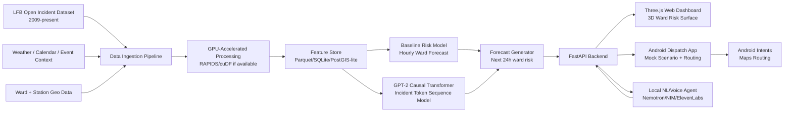
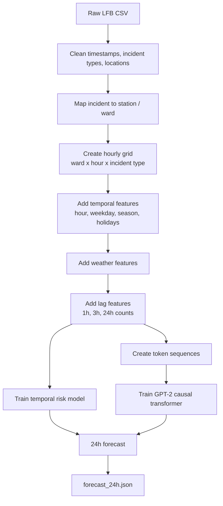
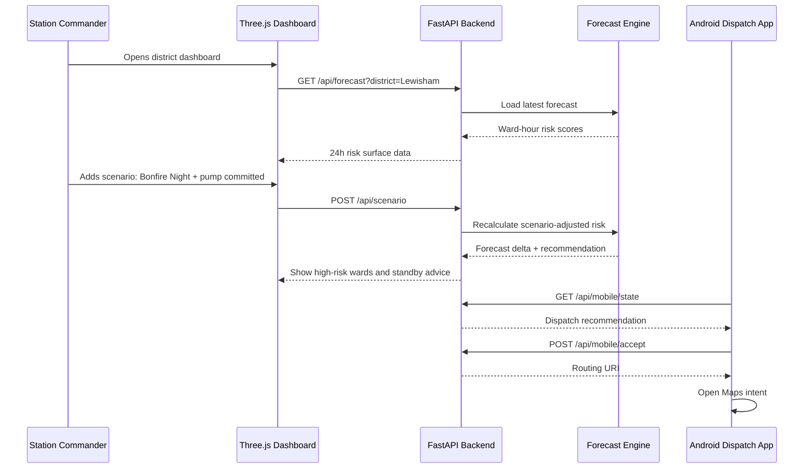

# Foresight for Fires

A locally-running spatiotemporal **decision-support system** for London Fire Brigade operations, inspired by the NHS Foresight AI project (Kraljevic et al., *Lancet Digital Health* 2024). We treat each fire station's call history as a token sequence and train a GPT-2 scale causal language model from scratch to learn the statistical rhythm of London's fire incidents, producing a dynamic ward-level risk surface for the next 24 hours — exposed through a 3D web dashboard, an Android mock-dispatch app, and a local natural-language voice assistant.

Built at **NVIDIA Hack London**. Track: **Urban Operations**. Runs entirely on **DGX Spark** — no cloud exposure.

> **Pitch:** Foresight for Fires ingests open LFB incident data, builds hourly ward-level risk forecasts, and lets commanders test operational scenarios such as pump shortages, weather changes, or Bonfire Night conditions. The web dashboard renders a 3D risk surface over London wards; the Android app turns model recommendations into mock dispatch actions and routing intents; the ElevenLabs voice assistant lets commanders query the system in natural language. Sensitive live operational data never leaves the box.

---

## Quick Start

### Prerequisites

```
python >= 3.10
node >= 18
torch >= 2.3  (CUDA recommended — DGX Spark GB10 used for training/inference)
```

Install Python dependencies:
```bash
pip install fastapi uvicorn pydantic torch numpy pandas pyarrow scikit-learn
```

Install frontend dependencies:
```bash
cd frontend && npm install
```

### 1. Generate the forecast (DGX Spark / GPU)

```bash
# Run inference — produces outputs/forecast_24h.json
python src/infer.py

# Optional overrides
python src/infer.py --date 2024-11-05 --hour 18          # specific date/time
python src/infer.py --temp 2.0 --rain 5.0 --wind 35      # weather scenario
python src/infer.py --n-rollouts 20 --max-new-tokens 150  # sampling knobs
```

A pre-generated `outputs/forecast_24h.json` is included so the backend and frontend work immediately without running inference.

### 2. Start the backend

```bash
uvicorn backend.main:app --host 0.0.0.0 --port 8000 --reload
```

Verify: `curl http://localhost:8000/health`

### 3. Start the web frontend

```bash
cd frontend && npm run dev
```

Opens at `http://localhost:5173` (Vite proxies `/api` → `:8000` automatically).

### 4. Run the Android app

Open the `android/` folder in Android Studio, let Gradle sync, and hit **Run**. Or via CLI:

```bash
cd android
./gradlew :app:assembleDebug
./gradlew :app:installDebug
```

Point the app at the backend by editing `android/app/src/main/java/com/foresight/dispatch/data/Api.kt`:
```kotlin
object Backend {
    const val BASE_URL = "http://10.0.2.2:8000/"   // emulator → host loopback
    // For a real device on the same Wi-Fi: "http://<HOST_LAN_IP>:8000/"
}
```

---

## Environment Variables

Copy the example files and fill in your keys:

```bash
cp frontend/.env.example frontend/.env
cp elevenlabs/.env.example elevenlabs/.env
```

| File | Variable | Purpose |
|---|---|---|
| `frontend/.env` | `VITE_API_URL` | Backend URL (leave unset in dev — Vite proxy handles it) |
| `elevenlabs/.env` | `ELEVENLABS_API_KEY` | ElevenLabs API key for the voice assistant |

The ElevenLabs agent ID is configured in `elevenlabs/agent_configs/Foresight-Map.json`. The voice agent works without a key in read-only mode but requires one for live conversation.

---

## Project Overview

Rather than predicting individual fires (which is noise), the model learns the **intensity function** — the expected rate of incidents per ward per unit time — as a function of historical patterns, weather, and calendar context. Sampling many forward rollouts from the trained model gives a probabilistic 24-hour heatmap over London's wards, rendered as an interactive Three.js 3D surface.

> "We help commanders decide where scarce standby resources should be positioned when local coverage is degraded" — **not** "we predict fires."

### Architecture

The system has four layers:

1. **DGX Spark (GPU)** — data preprocessing, model training (~19.5M param GPT-2 small), and Monte Carlo rollout inference (102 stations × 20 rollouts). Produces `outputs/forecast_24h.json`.
2. **FastAPI backend** — hot-reloads the JSON on file change; serves forecast, scenario, mobile, and ask routes; no GPU dependency.
3. **Three.js web dashboard** — 3D ward risk surface over a real London basemap, timeline scrubber, scenario panel, ElevenLabs voice agent.
4. **Android dispatch app** — Kotlin + WebView shell; Station tab (recommendation + Accept→Maps routing), Globe tab (3D risk), Assistant tab (ElevenLabs voice).

---

## System Architecture



### Data pipeline



### Runtime sequence



### DGX Spark handoff — what crosses the GPU boundary

The only thing the DGX Spark hands to the rest of the system is a single file: `outputs/forecast_24h.json`. All GPU work (preprocessing, training, rollout inference) happens **offline** on the Spark; the backend and frontend never touch CUDA. The handoff is a plain file the backend hot-reloads on `mtime` change — DGX overwrites the JSON, the next API request serves it with no restart and no code change.


**Handoff contract (the artifact):**

| Producer | Artifact | Consumer | Mechanism | Timing |
|---|---|---|---|---|
| DGX Spark (`infer.py`) | `outputs/forecast_24h.json` | Backend (`loader.py`) | File on disk, `mtime` hot-reload | Training ~1.5–3 hr (one-time); inference rollout produces the JSON per refresh |
| Backend (`routes/*`) | JSON over HTTP `:8000` | Web `:5173` + Android | FastAPI / REST | Per request (read-only, ms) |
| Backend (`scenario_logic.py`) | `forecast_delta` + recommendations | Web + Android | Rule-based, no GPU | Per request (deterministic, ms) |

> **Key design point for judges:** the GPU boundary is a single JSON file. The Spark can be busy training for hours while the live demo keeps serving the last-good forecast. Swapping fake data for the real model is a zero-code file swap — both conform to the same `WardForecast` schema.

---

## Model

**GPT-2 Small (19.5M params):** 6 layers, 8 heads, d_model=512, trained from scratch on 1.7M London Fire Brigade incidents tokenised as structured sequences.

Each incident becomes ~10–15 tokens:
```
<DT_30MIN> <STATION_LEWISHAM> <WARD_CATFORD_SOUTH> <TYPE_DWELLING_FIRE> <STOP_PRIMARY_FIRE> <PROP_DWELLING>
```

Inference runs **KV-cached batched Monte Carlo rollouts** — 20 rollouts per station batched into a single GPU call. The KV cache converts O(T²) decode to O(T), cutting 5,100-rollout inference from ~4–5 min to single-digit seconds on the GB10.

Output: 691 wards, 24 hourly bins, risk scores 0.004–1.000.

---

## Android App

A native Kotlin shell hosting a full-screen WebView. The entire UI is a self-contained React + MapLibre bundle in `app/src/main/assets/web/app.html`. Native capabilities (HTTP, Google Maps intents, toasts) are exposed to the web layer via a JavaScript bridge (`window.Android`).

### Tabs

| Tab | Description |
|---|---|
| **Station** | Station header, active pump count, AI recommendation card, live news feed. Accept → `POST /api/mobile/accept` → Google Maps turn-by-turn routing. |
| **Globe** | 3D ward risk surface with hourly time scrubber (MapLibre + Three.js). |
| **Assistant** | ElevenLabs Conversational AI voice orb. Detects ward names in agent replies and shows map cards inline. |

### Stack

- Kotlin + Jetpack Compose (Material 3), Retrofit + OkHttp + Gson
- AGP 8.13.2 · Kotlin 2.0.21 · Gradle 8.13 · compileSdk 36 · minSdk 26
- React + MapLibre (web bundle in WebView assets)

### Graceful fallback

Every backend call is non-blocking and fail-safe. If `/api/mobile/state` times out or fails, the app shows demo data (Lewisham, Brockley, risk 0.78) with a native toast: *"Live data unavailable — showing demo data."* The app is always demoable with or without a live server.

---

## Voice Agent (ElevenLabs)

The ElevenLabs Conversational AI agent (`elevenlabs/agent_configs/Foresight-Map.json`) is wired into both the web dashboard and the Android Assistant tab. It supports 12 client tools including:

| Tool | Action |
|---|---|
| `focus_ward` | Fly the 3D camera to a named ward |
| `highlight_risk` | Glow-ring the top-N highest risk wards |
| `rank_hotspots` | Return the highest-risk wards for the current hour |
| `scrub_time` | Move the timeline scrubber to a given hour |
| `get_ward_info` | Return risk, expected count, dominant type for a ward |
| `ward_trend` | Show risk trend across the 24h window |
| `filter_incident` | Filter the map to a specific incident type |
| `compare_wards` | Side-by-side risk comparison of two wards |
| `generate_day` | Run a scenario forecast for a named event/condition |

---

## Data Sources

| Dataset | Source | Licence |
|---|---|---|
| LFB Incident Records 2009–present (~1.7M rows) | [London Datastore](https://data.london.gov.uk/dataset/london-fire-brigade-incident-records-em8xy/) | OGL v3 |
| Met Office MIDAS Open hourly weather | [CEDA Archive](https://catalogue.ceda.ac.uk) | OGL v3 |
| Index of Multiple Deprivation 2019 | [London Datastore](https://data.london.gov.uk) | OGL v3 |
| ONS Census 2021 LSOA tables | [ONS](https://www.ons.gov.uk) | OGL v3 |
| LFB Bonfire/Diwali/Halloween incident records | [London Datastore](https://data.london.gov.uk/dataset/incidents-occuring-around-diwali-halloween---bonfire-night/) | OGL v3 |

Contains public sector information licensed under the [Open Government Licence v3.0](https://www.nationalarchives.gov.uk/doc/open-government-licence/version/3/).

---

## API Endpoints

| Method | Path | Purpose |
|---|---|---|
| `GET` | `/health` | Liveness + model/device status |
| `GET` | `/api/forecast?district=&incident_type=` | 24h ward risk surface |
| `POST` | `/api/scenario` | Scenario-adjusted forecast + recommendations |
| `POST` | `/api/ask` | Natural-language query → answer + actions |
| `GET` | `/api/mobile/state?station=` | Dispatch state for Android |
| `POST` | `/api/mobile/accept` | Accept recommendation → routing URI |

---

## Tech Stack

| Layer | Technologies |
|---|---|
| Model / Data | Python, pandas, PyTorch (CUDA), RAPIDS cuDF, Parquet, GeoPandas |
| Backend | FastAPI, Uvicorn, Pydantic |
| Web | React, Vite, Three.js, `@react-three/fiber`, ElevenLabs React SDK |
| Android | Kotlin, Jetpack Compose, Retrofit/OkHttp, React + MapLibre (WebView), ElevenLabs |
| Hardware | NVIDIA DGX Spark (GB10, 128 GB unified memory) |

---

## Repository Structure

```text
foresight-for-fires/
├── README.md
├── outputs/
│   └── forecast_24h.json          # pre-generated forecast (ready to serve)
├── src/
│   ├── clean.py                   # Phase 1 data cleaning
│   ├── tokenise.py                # Phase 2 tokenisation
│   ├── dataset.py                 # Phase 3 windowing + DataLoader
│   ├── model.py                   # GPT-2 model (train + KV-cached inference)
│   ├── train_gpt2.py              # Phase 4 training loop
│   ├── infer.py                   # Phase 5 Monte Carlo rollout → forecast JSON
│   └── eval.py                    # Phase 6 evaluation
├── backend/
│   ├── main.py                    # FastAPI app entry point
│   ├── loader.py                  # mtime hot-reload for forecast JSON
│   ├── schemas.py                 # Pydantic models
│   ├── ask_logic.py               # NL query handler
│   └── routes/
│       ├── forecast.py
│       ├── scenario.py
│       ├── mobile.py
│       ├── ask.py
│       └── generate.py
├── frontend/
│   ├── .env.example
│   └── src/
│       ├── App.tsx
│       ├── api.ts
│       └── components/
│           ├── RiskMap3D.tsx      # Three.js 3D risk surface
│           ├── TimelineScrubber.tsx
│           ├── ScenarioPanel.tsx
│           └── VoiceAgent.tsx     # ElevenLabs voice agent + client tools
├── android/
│   └── app/src/main/
│       ├── java/com/foresight/dispatch/
│       │   ├── MainActivity.kt    # WebView shell + JS bridge
│       │   ├── MapsLauncher.kt    # Google Maps routing intent
│       │   └── data/Api.kt        # Backend URL config
│       └── assets/web/            # Self-contained React + MapLibre UI bundle
├── elevenlabs/
│   ├── agent_configs/             # ElevenLabs agent configuration
│   ├── tool_configs/              # Client tool definitions (12 tools)
│   └── .env.example
└── docs/
    ├── INFERENCE_PERF.md
    ├── NVIDIA_STACK.md
    └── design/
```

---

## Judging Criteria

| Criterion | Pts | Our story |
|---|---|---|
| **Technical Execution** — Completeness (15) + Technical Depth (15) | 30 | Full local data-to-decision pipeline: raw LFB CSV → GPU preprocessing → GPT-2 training from scratch → KV-cached inference → 24h ward risk → 3D web viz → mobile dispatch. Everything runs end-to-end; no API calls to external models. |
| **NVIDIA / Spark** — The Stack (15) + Spark Story (15) | 30 | PyTorch CUDA training + inference on GB10. 128 GB unified memory keeps model + geo + agent resident. KV-cached batched rollouts exploit GPU parallelism. Sensitive operational data never leaves the machine. |
| **Value & Impact** — Insight Quality (10) + Usability (10) | 20 | Decision support for pre-positioning scarce standby resources when coverage is degraded. Three interfaces: 3D web dashboard, Android dispatch app, voice assistant. |
| **Innovation & Execution** — Creativity (10) + Performance (10) | 20 | Incident history as a language; dynamic ward risk surface; scenario-conditioned planning; mobile dispatch loop; local voice assistant with 12 map-control tools. |

---

## Known Limitations & Next Steps

- **Globe tab on Android** — currently uses client-side simulated risk data. The `/api/forecast` endpoint exists and returns the real per-ward hourly forecast; wiring the Globe tab to consume it is a straightforward fetch call.
- **Crew count** — shown as a static value in the Android app; not part of the current `MobileState` schema.
- **Ward geometry** — ward boundaries use centroid lat/lon for column placement rather than full polygon outlines. ONS boundary GeoJSON would enable true ward shading.
- **Live weather** — weather context is passed as CLI args or uses a historical lookup table. A Met Office API integration would make the forecast fully live.
- **ElevenLabs bounty** — the persistent agent session targeting ≥1h11m continuous conversation with Nemotron + ElevenLabs voice I/O is in progress (`docs/AGENT_EXPANSION_PLAN.md`).

---

## Team

| Name | Role | Contact |
|---|---|---|
| Harry Allen | Model / Data Lead | harry.allen-3@postgrad.manchester.ac.uk |
| Patrick Fan | Backend + Web Frontend Lead | fanpatrick8@gmail.com |
| Pranit Sehgal | Android + Dispatch / Voice Lead | pranitsehgal@gmail.com |
