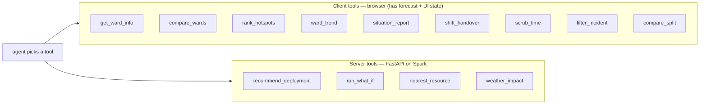

# Foresight Voice Agent — Expansion Plan (Groups A / B / C / E)

> Buildable handoff for extending the ElevenLabs voice agent beyond camera
> control into **ward knowledge + dispatch reasoning + live context + voice map
> control**. The voice loop already works end-to-end; this adds tools, not new
> transport. Architecture lives in [`PLAN_VOICE_AGENT.md`](./PLAN_VOICE_AGENT.md)
> — read §4 (tool contract), §6c, §7 (frontend wiring) before building.

---

## 0. Current state (what already works)

- ElevenLabs **public** agent drives the 3D map by voice via 3 client tools:
  `focus_ward`, `highlight_risk`, `reset_view`.
- `VoiceAgent.tsx` (right-rail "Dispatch Agent" console) = connect button + live
  status + activity log. Handlers run in the browser, drive the map.
- Brain today = ElevenLabs default LLM (gemini). Swapping to **Nemotron on DGX
  Spark** (Custom LLM) is independent — none of the tools below require it, they
  all work on the current brain.

| Thing | Value |
| --- | --- |
| Agent id | `agent_0801ktesr0p9fqsasacrwatev15k` |
| Agent config (as-code) | `elevenlabs/agent_configs/Foresight-Map.json` |
| Tool configs | `elevenlabs/tool_configs/*.json` |
| Dev frontend | http://localhost:5174 (NOT 5173 — Docker squats it) |
| Backend | http://localhost:8008 — serves 673 Greater London wards |

---

## 1. Workflow

- **Commit directly to `main`. No feature branches.**
- `git pull` first — teammates push on top of the voice work (perf + a
  `focus_ward` camera fix in `RiskMap3D.tsx`). Build on current main.
- Verify (`npx tsc -b`, `npx vite build`) green before each commit. Don't merge
  broken state.

---

## 2. The routing rule (keeps the agent fast)

- **Client tool** — when the browser already has the data or owns the UI state.
  The full forecast for all 673 wards is already in memory; the timeline hour and
  incident filter are React state. Instant, no network. Data-returning client
  tools set `expects_response = true` so the model waits for the values and speaks
  them.
- **Server tool** (webhook → FastAPI, reachable from EL cloud via the cloudflared
  tunnel) — when it needs compute, station data, scenario logic, or private
  historical data.



---

## 3. Tool specs

`resp` = `expects_response` (true → agent waits for the returned string and speaks
the values; false → fire-and-forget, snappier).

### Group A — Ward intelligence (client; reads in-memory forecast)

| Tool | Params | Returns / does | resp |
| --- | --- | --- | --- |
| `get_ward_info` | `wardName` | risk, expected_count, dominant_type, rank @ current hour | ✅ |
| `compare_wards` | `wardA`, `wardB` | which is higher risk + both stats | ✅ |
| `rank_hotspots` | `n` (default 5) | top-N wards by risk **and rings them on the map** | ✅ |
| `ward_trend` | `wardName` | 24h risk curve + peak hour | ✅ |

### Group B — Dispatch reasoning (server → FastAPI on Spark)

| Tool | Params | Backend | resp |
| --- | --- | --- | --- |
| `recommend_deployment` | — | `scenario_logic` + pump availability + station coords → pre-position advice | ✅ |
| `run_what_if` | `description` | `POST /api/scenario` → speaks the risk delta | ✅ |
| `nearest_resource` | `wardName` | new endpoint: closest available station/pump (station math) | ✅ |

Highest-value layer for Nemotron — multi-step reasoning over live state on owned
hardware.

### Group C — Live context fusion

| Tool | Params | Type | resp |
| --- | --- | --- | --- |
| `weather_impact` | — | server: Open-Meteo → reason wind/rain × risk | ✅ |
| `situation_report` | — | client: summarise whole-borough forecast → spoken brief | ✅ |
| `shift_handover` | — | client: end-of-shift summary | ✅ |

### Group E — Map control by voice (client; owns UI state)

| Tool | Params | Does | resp |
| --- | --- | --- | --- |
| `scrub_time` | `hour` (0–23) | moves the timeline scrubber (`setHour`) | ✕ |
| `filter_incident` | `type` | sets the incident filter dropdown | ✕ |
| `compare_split` | `wardA`, `wardB` | rings both wards at once | ✕ |

---

## 4. Build recipe (per tool)

**ElevenLabs side** (as-code in `elevenlabs/`, CLI already authed):

```bash
cd elevenlabs
elevenlabs tools add "<name>" --type client     # or: --type webhook  (server tools)
# edit tool_configs/<name>.json -> real description + parameters
# attach the returned tool id to agent_configs/Foresight-Map.json -> prompt.tool_ids
# extend the agent prompt text to describe the new tool
elevenlabs tools push && elevenlabs agents push
```

> **GOTCHA (verified):** the CLI camelCases parameter property KEYS but NOT the
> `required` array — so write BOTH in camelCase (`wardName`, `wardA`, `wardB`,
> `n`). Mismatch → `422 Unprocessable Entity` on push. Copy the working shape
> from `tool_configs/focus_ward.json`.

**Frontend side:**
- Client tool → add a `useConversationClientTool(name, handler)` in
  `VoiceAgent.tsx` (copy the `focus_ward` pattern). Handler computes from the
  forecast + current hour, `push()`es a log entry, and RETURNS a short string for
  the agent to speak.
- Server tool → add the FastAPI endpoint + (if it must change the map) a callback
  threaded App → VoiceAgent.

**Data shape** (`frontend/src/api.ts`):
```ts
WardForecast = { ward_id, ward_name, lat, lon,
  hourly: [{ hour, risk_score, expected_count, dominant_type }] }
```
`App.tsx` holds `forecast` + `hour` (scrubber). Ranking = sort all wards by
`risk_score` at the current `hour`.

---

## 5. Group A — ready-to-build detail (start here)

1. **Props:** `VoiceAgent` currently receives `wardsLite` (id+name only). Group A
   needs hourly data — pass full `forecast.wards` + current `hour` as new props
   from `App.tsx`. Keep the existing fuzzy `matchWard()` for name resolution.
2. **`get_ward_info` / `compare_wards` / `ward_trend`:** pure reads; return a
   spoken string, no map change.
3. **`rank_hotspots`:** also highlight. Add `onHighlightWards(ids: string[])` in
   `App.tsx` → `setFocusWardId(null)` + `setHighlightSet(new Set(ids))`.
   `RiskMap3D` already renders rings from `highlightSet`. Thread the callback to
   the handler.
4. **EL tools:** create all 4 with `--type client`, `expects_response: true`,
   camelCase params; attach ids; describe them in the agent prompt; push.

---

## 5b. Group E — voice map control detail

Pure client tools — they only push existing React state, no data returned, so
`expects_response: false` (snappier; agent just confirms verbally).

1. **Props:** `VoiceAgent` needs the same setters `App.tsx` already wires to the
   UI controls. Pass them as callbacks (don't reach into the map directly):
   - `onScrubTime(hour: number)` → `setHour(clamp(hour, 0, 23))` (the same setter
     the timeline scrubber uses).
   - `onFilterIncident(type: string | null)` → `setIncidentFilter(type)` (the same
     state the dropdown sets; `null`/"all" clears it).
   - reuse `onHighlightWards(ids)` from §5.3 for `compare_split`.
2. **`scrub_time`:** resolve a spoken hour to 0–23 (handle "2am", "14:00",
   "2 in the afternoon" → let the agent normalise to an int in the prompt; clamp
   in the handler as a guard). Call `onScrubTime`, `push()` a log line, return
   "" / short ack.
3. **`filter_incident`:** map the spoken type to a valid `dominant_type` value
   (fuzzy-match against the known incident types; pass `null` for "all" /
   "clear filter"). Call `onFilterIncident`.
4. **`compare_split`:** resolve both ward names via existing `matchWard()`, then
   `onHighlightWards([idA, idB])`. Same ring path as `rank_hotspots`, just two
   ids — dedupe per §7.
5. **EL tools:** create all 3 with `--type client`, `expects_response: false`,
   camelCase params (`hour`, `type`, `wardA`, `wardB`); attach ids; describe in
   the agent prompt (tell it to normalise hour → int and incident phrase → type);
   push.

> **Casing guard:** same §4 gotcha — keys AND the `required` array both camelCase.

---

## 6. Verification

- `cd frontend && npx tsc -b` clean; `npx vite build` clean.
- Dev on **:5174**, backend on **:8008** (673 wards).
- Live phrases:
  - A: "what's the risk in West End", "compare Whitechapel and Soho",
    "top 5 hotspots" (rings appear), "what's the trend in Marylebone"
  - E: "show me 2am", "show only dwelling fires", "compare Catford and Lewisham"
- Commit to `main` when green.

---

## 7. Known gotchas

- **Duplicate `ward_id`s** in the 673-ward data — when ringing top-N, dedupe;
  map columns are keyed `ward_id-index` to avoid React key collisions.
- **Wrong port** — the app is :5174; :5173 is Docker, shows nothing useful.
- **Mic** needs HTTPS or localhost (dev = localhost, fine).
- **Param key casing** — see §4 gotcha.
- These tools work on **today's brain**; the Nemotron/Spark swap (Phase 2 in the
  architecture doc) is orthogonal and not a blocker.
```
