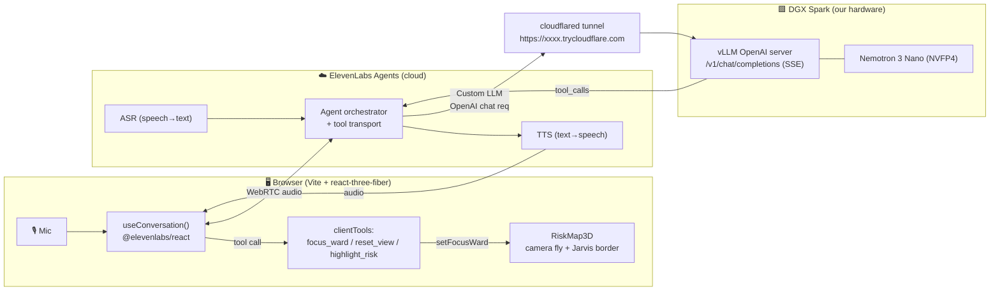
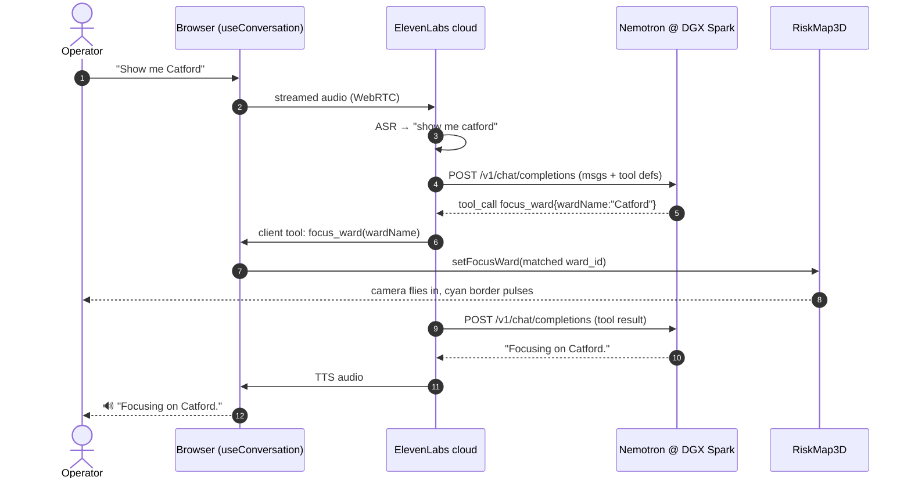
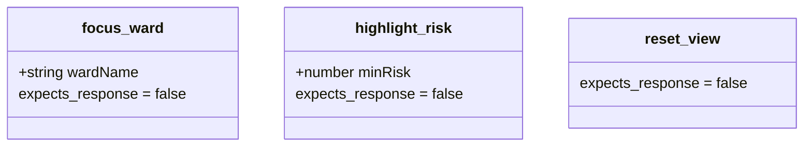
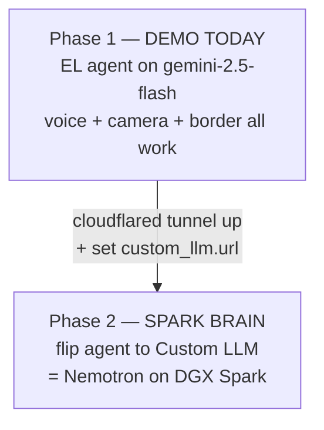
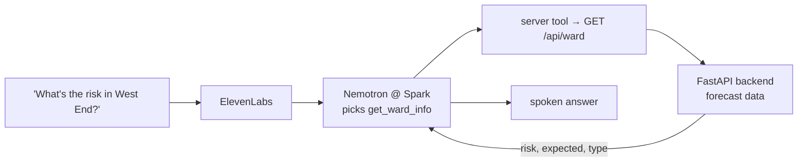
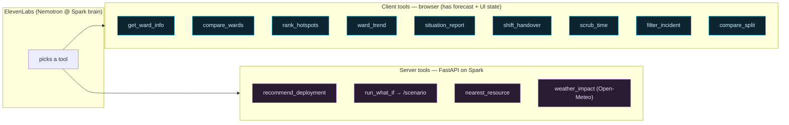
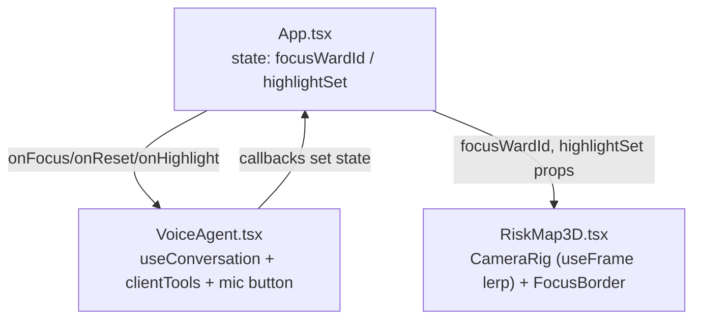

# Foresight — Voice Agent Plan (ElevenLabs × Nemotron on DGX Spark)

> Jarvis-style voice control for the 3D fire-risk map. Operator talks → agent zooms
> the camera to a ward and lights a glowing border. The **reasoning brain** is
> NVIDIA **Nemotron** served on a **DGX Spark**; **ElevenLabs** does speech-in /
> speech-out and transports tool calls to the browser.

---

## 1. Why this shape

We split the system into three concerns, each handled by the thing best at it:

| Concern | Owner | Why |
| --- | --- | --- |
| Speech-to-text, text-to-speech, turn-taking, barge-in | **ElevenLabs Agents** | Production-grade low-latency voice loop, nothing to build |
| Reasoning + tool selection ("which ward, which action") | **Nemotron on DGX Spark** | The "agentic actions" brain runs on our own NVIDIA hardware |
| Executing the action (camera fly + border glow) | **Browser (react-three-fiber)** | The map lives in the browser; client tools fire local JS |

ElevenLabs supports a **Custom LLM**: instead of its built-in model, the agent
calls *any* OpenAI-compatible `/v1/chat/completions` endpoint. We point that at
Nemotron-on-Spark. Tool definitions ride along in each request; Nemotron returns
OpenAI-format `tool_calls`; ElevenLabs routes those **client tools** down to the
browser over the live WebRTC session. So Spark is literally the server for the
agentic actions, exactly as intended.

---

## 2. System architecture



**Key boundary:** the map actions never touch Spark or ElevenLabs servers —
they run as JS in the browser. Spark only decides *what* to do; the browser does it.

---

## 3. Conversation sequence (one "show me Catford")



---

## 4. Tool contract (client tools)

Defined in ElevenLabs, executed in the browser. **Param keys are camelCase**
(the ElevenLabs CLI camelCases them on push).

| Tool | Params | Browser action |
| --- | --- | --- |
| `focus_ward` | `wardName: string` | Fuzzy-match to a ward, fly camera, pulse cyan border |
| `highlight_risk` | `minRisk: number` (0–1) | Border-glow every ward with risk ≥ threshold |
| `reset_view` | — | Fly back to borough overview, clear borders |



`expects_response = false` → fire-and-forget, snappier feel (agent doesn't wait
for the browser to confirm before speaking).

---

## 5. Live IDs (already provisioned)

| Thing | ID |
| --- | --- |
| Agent "Foresight Map" | `agent_0801ktesr0p9fqsasacrwatev15k` |
| Tool `focus_ward` | `tool_4601ktesyr84ern8dmwyca4w0xmv` |
| Tool `reset_view` | `tool_8201ktesys06exbsyjfccdpwjqcb` |
| Tool `highlight_risk` | `tool_1901ktesyst3edptv7t0mhpa9tb3` |
| Auth | `enable_auth: false` → **public** (connect with agentId, no signed URL) |

All managed as code under `elevenlabs/` (agents-as-code). Re-push after edits:

```bash
cd elevenlabs
elevenlabs tools push      # push tool param changes
elevenlabs agents push     # push prompt / tool wiring
```

---

## 6. Two-phase rollout

We ship the **voice + map** loop today on the default ElevenLabs LLM, then flip
the brain to Nemotron-on-Spark when the box is reachable. Same agent, one config field.



### Model-tier tradeoff (why Nano)

There is **no "Nemotron 3 Medium"** — the lineup is Nano → Super → Ultra. We use
**Nano**: the voice loop only does tool routing (pick 1 of 3 tools, fill one arg),
so the latency win dominates the reasoning gap.

| Model | Total / active | Fits 1 Spark? | Decode (Spark/vLLM/NVFP4) | Voice feel | Verdict |
| --- | --- | --- | --- | --- | --- |
| **Nano** 30B-A3B | 30B / ~3B | ✅ | **~57–75 tok/s** | crisp, instant | ✅ chosen |
| Super 120B-A12B ("medium") | 120B / ~12B | ✅ tight | ~23 tok/s | ~3× slower, audible drag | reasoning-heavy off-voice only |
| Ultra ~500B-A50B | 500B / ~50B | ❌ | — | — | not single-Spark |

If we later add heavy multi-step analysis ("compare 4 wards, plan pump moves"),
run Super on a **separate** non-voice endpoint — never in the speech path.

### Phase 2 — bring up Nemotron on DGX Spark

```bash
# On the DGX Spark — vLLM OpenAI-compatible server (Nemotron 3 Nano, NVFP4)
docker run --rm --gpus all -p 8000:8000 \
  vllm/vllm-openai:cu130-nightly \
  --model nvidia/NVIDIA-Nemotron-3-Nano-NVFP4 \
  --enable-auto-tool-choice \
  --tool-call-parser nemotron \
  --served-model-name foresight-nemotron
# (exact model id + Spark runtime flags: follow NVIDIA's Spark deployment guide)
```

Expose it to the ElevenLabs cloud (Spark is on a LAN; EL must reach it):

```bash
cloudflared tunnel --url http://localhost:8000
# → prints https://<random>.trycloudflare.com
```

Point the agent at it (in `agent_configs/Foresight-Map.json`):

```jsonc
"prompt": {
  "llm": "gemini-2.5-flash",          // ignored once custom_llm is set
  "custom_llm": {
    "url": "https://<random>.trycloudflare.com/v1",
    "model_id": "foresight-nemotron",
    "api_key": { "secret_id": "<workspace-secret-with-any-value>" }
  }
}
```

```bash
elevenlabs agents push   # flip the brain to Spark
```

### Phase 2b — give the agent ward knowledge

Right now the agent can *drive* the map but knows nothing *about* a ward (its
risk, expected incidents, dominant type, neighbours). Add a **server tool** so
Nemotron-on-Spark can answer "what's the risk in West End?" — not just zoom.

Two ways, smallest first:

1. **Server tool → existing backend** (recommended): register a server (webhook)
   tool `get_ward_info(wardName)` that the agent calls; it hits a new
   `GET /api/ward?name=` on the FastAPI backend, returns `{risk, expected_count,
   dominant_type, rank}` for the current hour. The agent speaks the numbers.
   - `elevenlabs tools add "get_ward_info" --type webhook`
   - point its URL at the backend (must be reachable from EL cloud → same
     cloudflared trick, or host the backend on the Spark too).
2. **Knowledge base / RAG**: upload a generated ward fact-sheet (one row per ward:
   name, borough, baseline risk, top incident types) to the agent's knowledge
   base. Good for static facts, not live hourly risk.



Keep client tools (camera) and the new server tool (data) separate: camera
actions stay instant/fire-and-forget; data lookups set `expects_response = true`
so the agent waits for the numbers before speaking.

**Requirements for Phase 2 to work**
- Nemotron build must support **function/tool calling** (vLLM `--enable-auto-tool-choice --tool-call-parser nemotron`).
- Endpoint must stream **SSE** (`Content-Type: text/event-stream`) — vLLM's OpenAI server does.
- Pick **Nano** (low latency) over 120B-Super; voice turns need fast first-token.
- Tunnel URL changes each `cloudflared` run (use a named tunnel for stability).

---

## 6c. Agent capability roadmap (A / B / C / E)

Beyond driving the camera, the agent gains **knowledge** and **reasoning** tools.
Design rule that keeps it fast:

- **Client tool** when the browser already has the data or owns the UI state
  (the forecast for all 673 wards is already in memory, plus timeline/filter
  state). Instant, no network. Data-returning client tools set
  `expects_response = true` so Nemotron waits for the values, then speaks them.
- **Server tool** (webhook → FastAPI on the Spark) when it needs compute,
  station data, scenario logic, or private historical data. Reachable from the
  EL cloud via the same cloudflared tunnel.



### A — Ward intelligence (client tools; reads in-memory forecast)

| Tool | Params | Returns / does | resp |
| --- | --- | --- | --- |
| `get_ward_info` | `wardName` | risk, expected_count, dominant_type, rank @ current hour | ✅ |
| `compare_wards` | `wardA`, `wardB` | which is higher risk + both stats | ✅ |
| `rank_hotspots` | `n` (default 5) | top-N wards by risk **and rings them on the map** | ✅ |
| `ward_trend` | `wardName` | 24h risk curve + peak hour | ✅ |

### B — Dispatch reasoning (server tools → FastAPI on Spark)

| Tool | Params | Backend | resp |
| --- | --- | --- | --- |
| `recommend_deployment` | — | `scenario_logic` + pump availability + station coords → pre-position advice | ✅ |
| `run_what_if` | `description` | `POST /api/scenario` → speaks the risk delta | ✅ |
| `nearest_resource` | `wardName` | new endpoint: closest available station/pump (station math) | ✅ |

This is the layer that most justifies Nemotron — multi-step reasoning over live
state, on owned hardware.

### C — Live context fusion

| Tool | Params | Type | resp |
| --- | --- | --- | --- |
| `weather_impact` | — | server: Open-Meteo → reason wind/rain × risk | ✅ |
| `situation_report` | — | client: summarise whole-borough forecast → spoken brief | ✅ |
| `shift_handover` | — | client: end-of-shift summary | ✅ |

### E — Map control by voice (client tools; own UI state)

| Tool | Params | Does | resp |
| --- | --- | --- | --- |
| `scrub_time` | `hour` (0–23) | moves the timeline scrubber (`setHour`) | ✕ |
| `filter_incident` | `type` | sets the incident filter dropdown | ✕ |
| `compare_split` | `wardA`, `wardB` | rings both wards at once | ✕ |

Each new tool = one `elevenlabs tools add … --type client|webhook`, edit its
config, attach its id to the agent, `elevenlabs tools push && elevenlabs agents
push`. Client tools also need a matching `useConversationClientTool` handler in
`VoiceAgent.tsx`; server tools need the FastAPI endpoint.

## 7. Frontend integration map



- **`VoiceAgent.tsx`** — mic button, opens the EL session with `agentId`, maps the
  3 client tools to callbacks. Fuzzy-matches spoken ward name → `ward_id`.
- **`RiskMap3D.tsx`** — new `CameraRig` lerps `OrbitControls` toward the focused
  ward each frame; `FocusBorder` draws a steady ring + expanding pulse (Bloom does
  the glow). New props: `focusWardId`, `highlightSet`.
- **`App.tsx`** — owns `focusWardId` / `highlightSet`, wires callbacks ↔ props.

Env (`frontend/.env`):

```
VITE_ELEVENLABS_AGENT_ID=agent_0801ktesr0p9fqsasacrwatev15k
```

---

## 8. Risks & mitigations

| Risk | Mitigation |
| --- | --- |
| Mic needs HTTPS/localhost | Vite dev = localhost ✔; for LAN demo use a tunnel or `--host` + cert |
| Public agent = anyone with ID can talk | Fine for hackathon; set `enable_auth: true` + signed URL for prod |
| Spark tunnel latency hurts voice | Use Nemotron **Nano**, `optimize_streaming_latency`, keep prompt short |
| Nemotron tool-calling format drift | vLLM `--tool-call-parser nemotron`; verify with a raw curl before wiring EL |
| Ward name mishearing | Fuzzy match (exact → contains → reverse-contains) + agent confirms choice |
| EL free-tier minute caps | Demo-sized; monitor usage |

---

## 9. Build checklist

- [x] ElevenLabs agent + 3 client tools provisioned as code (`elevenlabs/`)
- [x] Agent public (`enable_auth: false`), tactical prompt, tools attached
- [ ] `npm i @elevenlabs/react` in `frontend/`
- [ ] `VoiceAgent.tsx` (mic + clientTools)
- [ ] `RiskMap3D` camera fly + Jarvis border + highlight set
- [ ] `App.tsx` wiring + `.env`
- [ ] Phase 2: Nemotron on Spark + cloudflared + flip `custom_llm`
- [ ] **A — ward intelligence** (client): `get_ward_info`, `compare_wards`, `rank_hotspots`, `ward_trend`
- [ ] **B — dispatch reasoning** (server): `recommend_deployment`, `run_what_if`, `nearest_resource`
- [ ] **C — live context**: `weather_impact` (server), `situation_report`, `shift_handover` (client)
- [ ] **E — map control** (client): `scrub_time`, `filter_incident`, `compare_split`
```
