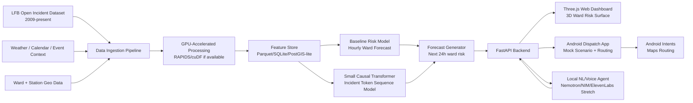
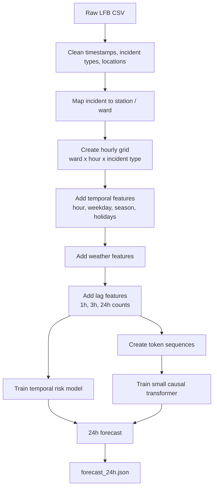
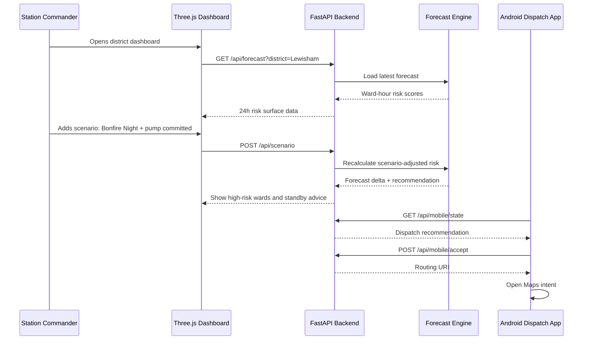

Below is a practical **24-hour systems-engineering build contract + architecture plan** for the 3-person team.

The key principle: **do not overbuild the research model**. For judging, you need a working end-to-end local system that ingests raw London Fire Brigade data, processes it on DGX Spark, produces credible forecasts, and exposes them through impressive operational interfaces.

DGX Spark is a strong fit because it supports local AI development/inference with **128GB coherent unified memory**, local NIM/AI stack support, and workloads such as data science, fine-tuning, inference, and agentic applications. NVIDIA describes it as suitable for local AI agents, fine-tuning up to 70B-parameter models, and inference with models up to 200B parameters. ([NVIDIA][1])

---

# Foresight for Fires — 3-Person Build Contract

## 0. Project Goal

Build a locally running prototype system that predicts short-term fire incident risk across London wards/stations and lets operators explore or act on the forecast.

The system should demonstrate:

1. **Raw data ingestion** from LFB open incident data.
2. **Local accelerated processing** on DGX Spark.
3. **Spatiotemporal risk forecasting** for the next 24 hours.
4. **Interactive operational interface**:

   * Web dashboard with 3D ward-level risk surface.
   * Android mock dispatch app for scenario testing.
   * Voice/natural-language assistant if time allows.
5. **Clear “Spark Story”**:

   * Local processing for privacy-sensitive operational data.
   * Fast GPU-accelerated preprocessing/inference.
   * Capacity to run model + geospatial pipeline + voice/agent components locally.

---

# 1. Realistic Scope

## What is realistic in 24 working hours

### Must-build MVP

You should aim to complete:

* Load and clean LFB incident data.
* Aggregate incidents into station/ward/hour sequences.
* Train either:

  * a lightweight GPT-style causal model, or
  * a strong fallback temporal risk model.
* Generate 24-hour risk forecasts by ward and incident type.
* Serve forecasts through an API.
* Render a 3D Three.js London ward risk surface.
* Android app that receives mock dispatch recommendations and opens routing through Android intents.
* Simple natural-language query layer using local LLM/NIM or a structured rule-based parser.

### Stretch goals

Only attempt these after the MVP works:

* Full tokenized incident-sequence model from scratch.
* Nemotron/NIM agent with memory.
* ElevenLabs voice input/output.
* cuOpt route optimization.
* Live pump availability conditioning.
* Persistent 1h11m bounty agent.

---

# 2. Team Split

## Person A — Model/Data Lead

**Main responsibility:** Turn raw LFB data into forecasts.

### Owns

* Data ingestion.
* Cleaning and feature engineering.
* Ward/station/time aggregation.
* Weather/calendar context joining.
* Model training.
* Forecast generation.
* Model evaluation.
* Exporting predictions to backend.

### Deliverables

By the end:

```text
/data/processed/incidents.parquet
/data/processed/station_hour_sequences.parquet
/models/fire_risk_model.pt or /models/fire_risk_model.pkl
/outputs/forecast_24h.json
/outputs/forecast_24h.parquet
/scripts/train_model.py
/scripts/generate_forecast.py
```

### Minimum viable model

Use a two-level model strategy:

#### Level 1: Reliable baseline model

This should be done first.

Input features:

```text
ward_id
station_id
hour_of_day
day_of_week
month
is_weekend
is_holiday_or_event
incident_type
recent_1h_count
recent_3h_count
recent_24h_count
weather_temperature
weather_rain
weather_wind
weather_condition
```

Target:

```text
incident_count_next_hour
```

Model options:

* LightGBM/XGBoost if available.
* RAPIDS cuML RandomForest/XGBoost-style model if available.
* PyTorch MLP.
* Poisson/negative-binomial style count model.

Output:

```json
{
  "generated_at": "2026-06-05T18:00:00Z",
  "horizon_hours": 24,
  "predictions": [
    {
      "ward_id": "E05009317",
      "ward_name": "Lewisham Central",
      "hour": 1,
      "incident_type": "dwelling_fire",
      "risk_score": 0.73,
      "expected_count": 1.24,
      "lat": 51.462,
      "lon": -0.010
    }
  ]
}
```

#### Level 2: Token-sequence model

This is the more innovative model. Build only after the baseline is functional.

Token format:

```text
<WEATHER_RAIN_HEAVY>
<TEMP_COLD>
<DOW_FRI>
<HOUR_18>
<STATION_LEWISHAM>
<WARD_E05009317>
<TYPE_DWELLING_FIRE>
<DT_30MIN>
<STATION_LEWISHAM>
<WARD_E05009321>
<TYPE_FALSE_ALARM>
<DT_2H>
...
```

Training objective:

```text
Predict next incident token sequence.
```

Practical recommendation:

Do **not** train a full GPT-2 scale model from scratch in 24 hours unless the rest of the system is already done.

Instead:

* Train a small causal transformer:

  * 4–6 layers.
  * 256–512 hidden size.
  * sequence length 128–512.
  * station-level sequence batches.
* Then sample likely future incident sequences.
* Convert sampled incidents into ward-hour risk scores.

This gives you the story:

> “We modelled fire incidents as a language of urban emergencies.”

Even if the final risk map uses the baseline as fallback, the transformer adds technical depth.

### Evaluation metrics

Person A should produce a simple model card:

```text
Temporal validation split:
Train: 2009–2022
Validation: 2023
Test/demo: 2024–present

Metrics:
- MAE for hourly incident count
- Top-k ward recall
- Calibration by risk decile
- Incident-type confusion or per-type error
```

For judging, the most important metric is probably:

```text
Top 10 high-risk wards contain X% of next-hour incidents.
```

That is more operationally understandable than loss.

---

## Person B — Backend + Web Frontend Lead

**Main responsibility:** Make the system visible, interactive, and impressive.

### Owns

* FastAPI backend.
* Forecast API.
* Scenario API.
* Three.js/React frontend.
* Ward 3D visualization.
* Operator planning UI.
* Connection to model outputs.
* Local deployment script.

### Deliverables

```text
/backend/main.py
/backend/routes/forecast.py
/backend/routes/scenario.py
/backend/routes/dispatch.py
/frontend/src/App.tsx
/frontend/src/components/RiskMap3D.tsx
/frontend/src/components/TimelineScrubber.tsx
/frontend/src/components/ScenarioPanel.tsx
/docker-compose.yml or run_all.sh
```

### API contract

#### 1. Health check

```http
GET /health
```

Response:

```json
{
  "status": "ok",
  "model_loaded": true,
  "forecast_available": true,
  "device": "DGX Spark local"
}
```

#### 2. Get 24-hour risk forecast

```http
GET /api/forecast?district=Lewisham&incident_type=all
```

Response:

```json
{
  "district": "Lewisham",
  "generated_at": "2026-06-05T18:00:00Z",
  "horizon_hours": 24,
  "wards": [
    {
      "ward_id": "E05009317",
      "ward_name": "Lewisham Central",
      "geometry_id": "E05009317",
      "lat": 51.462,
      "lon": -0.010,
      "hourly": [
        {
          "hour": 0,
          "risk_score": 0.42,
          "expected_count": 0.31,
          "dominant_type": "false_alarm"
        },
        {
          "hour": 1,
          "risk_score": 0.57,
          "expected_count": 0.48,
          "dominant_type": "dwelling_fire"
        }
      ]
    }
  ]
}
```

#### 3. Scenario forecast

```http
POST /api/scenario
```

Request:

```json
{
  "district": "Lewisham",
  "time": "2026-11-05T19:00:00",
  "weather": {
    "rain": "none",
    "wind": "high",
    "temperature": 7
  },
  "events": ["bonfire_night"],
  "pump_availability": {
    "Lewisham": 1,
    "Deptford": 2,
    "New Cross": 0
  },
  "ongoing_incidents": [
    {
      "ward": "Lewisham Central",
      "type": "outdoor_fire",
      "pumps_committed": 2
    }
  ]
}
```

Response:

```json
{
  "scenario_id": "scenario_001",
  "summary": "Elevated outdoor fire and secondary fire risk around Lewisham Central and Brockley over the next 3 hours.",
  "recommendations": [
    {
      "action": "pre_position",
      "resource": "standby_pump",
      "from_station": "Deptford",
      "to_ward": "Lewisham Central",
      "reason": "High expected outdoor fire risk and reduced Lewisham pump availability.",
      "priority": 1
    }
  ],
  "forecast_delta": [
    {
      "ward_id": "E05009317",
      "baseline_risk": 0.44,
      "scenario_risk": 0.72,
      "delta": 0.28
    }
  ]
}
```

#### 4. Natural language query

```http
POST /api/ask
```

Request:

```json
{
  "query": "Two pumps are committed in Lewisham and it's Bonfire Night, where should I pre-position the standby?"
}
```

Response:

```json
{
  "answer": "Pre-position one standby pump near Lewisham Central or Brockley. The model predicts elevated outdoor fire risk over the next 3 hours, while local pump availability is reduced.",
  "recommended_actions": [
    {
      "type": "pre_position",
      "target": "Lewisham Central",
      "confidence": 0.78
    }
  ],
  "supporting_forecast_ids": ["E05009317", "E05009322"]
}
```

### Web frontend features

Must-have:

* London ward map rendered in Three.js.
* Risk shown by:

  * colour,
  * elevation,
  * tooltip.
* Timeline scrubber:

  * hour 0 to hour 23.
* Incident type filter:

  * all,
  * dwelling fire,
  * outdoor fire,
  * false alarm,
  * road traffic collision.
* Scenario panel:

  * select district,
  * change weather,
  * set pump availability,
  * add ongoing incident,
  * submit scenario.
* Recommendation card:

  * “Move standby pump from X to Y.”
  * “High-risk wards in next 3 hours.”
  * “Reason.”

Stretch:

* Animated risk wave over 24 hours.
* Before/after scenario comparison.
* Natural-language chat box.

### Three.js visual metaphor

Each ward polygon becomes a raised surface:

```text
height = risk_score * max_height
colour = low risk → high risk
animation = hour index
```

Even if geometry is simplified, the visual will score well if it clearly shows a dynamic city risk surface.

---

## Person C — Android + Dispatch/Voice Lead

**Main responsibility:** Make the system feel operational.

### Owns

* Android mobile app.
* Mock dispatch workflow.
* Receiving recommendations from backend.
* Android intents for routing.
* Scenario testing UI.
* Optional voice interface.
* Optional ElevenLabs/Nemotron bounty path.

### Deliverables

```text
/android/app/src/main/...
/android/README.md
/backend/routes/mobile.py
/backend/routes/agent.py
```

### Android MVP

The Android app should allow a fire-station user to:

1. Select station/district.
2. View current mock incident queue.
3. View recommended standby/pre-position action.
4. Accept or reject recommendation.
5. Open routing to destination using Android intent.
6. Send status update back to backend.

### Android API contract

#### 1. Get mobile dispatch state

```http
GET /api/mobile/state?station=Lewisham
```

Response:

```json
{
  "station": "Lewisham",
  "available_pumps": 1,
  "ongoing_incidents": [
    {
      "incident_id": "mock_001",
      "type": "outdoor_fire",
      "location": "Lewisham Central",
      "status": "active"
    }
  ],
  "recommendations": [
    {
      "recommendation_id": "rec_001",
      "action": "pre_position",
      "destination": "Brockley",
      "lat": 51.464,
      "lon": -0.036,
      "reason": "Predicted risk spike between 19:00 and 21:00."
    }
  ]
}
```

#### 2. Accept recommendation

```http
POST /api/mobile/accept
```

Request:

```json
{
  "recommendation_id": "rec_001",
  "station": "Lewisham",
  "unit": "Pump 1",
  "accepted": true
}
```

Response:

```json
{
  "status": "accepted",
  "routing_uri": "geo:51.464,-0.036?q=51.464,-0.036(Brockley standby position)"
}
```

### Android intent routing

Use:

```kotlin
val uri = Uri.parse("geo:$lat,$lon?q=$lat,$lon($label)")
val intent = Intent(Intent.ACTION_VIEW, uri)
intent.setPackage("com.google.android.apps.maps")
startActivity(intent)
```

### Voice MVP

Minimum version:

* Android speech-to-text using native Android speech recognizer.
* Send transcribed text to `/api/ask`.
* Display answer.
* Use Android text-to-speech to read response.

Better bounty version:

* ElevenLabs voice for input/output.
* Local Nemotron/NIM or NeMo-based agent for reasoning.
* Persistent session log for 1h11m.

---

# 3. Whole-System Architecture

## Mermaid system diagram



---

## Data pipeline diagram



---

## Runtime API architecture



---

# 4. Shared Data Contracts

## Forecast object

Every team should agree this is the central object.

```typescript
type ForecastPoint = {
  ward_id: string;
  ward_name: string;
  district?: string;
  station_area?: string;
  lat: number;
  lon: number;
  hour: number;
  timestamp: string;
  incident_type: string;
  risk_score: number;       // 0 to 1
  expected_count: number;   // predicted count
  uncertainty?: number;
};
```

## Recommendation object

```typescript
type Recommendation = {
  recommendation_id: string;
  action: "pre_position" | "hold" | "dispatch" | "monitor";
  priority: number;
  from_station?: string;
  to_ward?: string;
  destination_lat?: number;
  destination_lon?: number;
  resource?: string;
  reason: string;
  confidence: number;
};
```

## Scenario object

```typescript
type Scenario = {
  district: string;
  time: string;
  weather: {
    rain?: string;
    wind?: string;
    temperature?: number;
  };
  events?: string[];
  pump_availability: Record<string, number>;
  ongoing_incidents: {
    ward: string;
    type: string;
    pumps_committed: number;
  }[];
};
```

---

# 5. Recommended Technical Stack

## Model/Data

Use:

```text
Python
pandas / polars
RAPIDS cuDF if available
PyTorch
scikit-learn fallback
Parquet
GeoPandas if geometry is needed
```

NVIDIA scoring angle:

* Use **RAPIDS/cuDF** for accelerated preprocessing if possible.
* Use **PyTorch CUDA** on Spark for model training/inference.
* Use **NIM/Nemotron** for natural-language assistant if available.
* Mention local inference and privacy.

DGX Spark’s official page highlights its local AI software stack, NIM support, 128GB unified memory, and suitability for AI agents, fine-tuning, inference, and data science workloads. ([NVIDIA][1])

## Backend

Use:

```text
FastAPI
Uvicorn
Pydantic
SQLite or DuckDB
Parquet files
```

Avoid complex databases unless already familiar.

## Web

Use:

```text
React
Vite
Three.js
MapLibre optional
Tailwind optional
```

## Android

Use:

```text
Kotlin
Jetpack Compose
Retrofit or Ktor client
Android Maps intent
Android SpeechRecognizer
Android TextToSpeech
```

---

# 6. Judging Criteria Mapping

## 1. Technical Execution & Completeness — 30 pts

Your strongest story:

> “We built a full local data-to-decision pipeline: raw LFB incidents → GPU preprocessing → model training → 24-hour ward risk forecast → 3D web visualization → mobile dispatch workflow.”

### What to demo

1. Start backend.
2. Generate forecast.
3. Open web dashboard.
4. Scrub 24-hour risk timeline.
5. Run scenario:

   * Lewisham,
   * Bonfire Night,
   * two pumps committed,
   * high wind.
6. Show changed risk surface.
7. Android receives recommendation.
8. Android opens routing intent.

## 2. NVIDIA Ecosystem & Spark Utility — 30 pts

### NVIDIA stack points

You should use at least one of:

* RAPIDS/cuDF for preprocessing.
* PyTorch CUDA for model training.
* NVIDIA NIM/Nemotron for local natural-language assistant.
* cuOpt for routing optimization, if realistic.

Most realistic:

```text
RAPIDS/cuDF + PyTorch CUDA
```

Stronger:

```text
RAPIDS/cuDF + PyTorch CUDA + NIM/Nemotron local assistant
```

### Spark story

Say:

> “This system is designed for operational fire-service data. The open LFB dataset trains the model, but the high-value use case is conditioning forecasts on live pump availability and active incidents. Those data should not leave the operational environment. DGX Spark lets us run preprocessing, model inference, and the assistant locally, using the 128GB unified memory to keep the forecast model, geospatial data, and agent context resident on one machine.”

## 3. Value & Impact — 20 pts

Avoid saying:

> “We predict fires.”

Say:

> “We help commanders decide where scarce standby resources should be positioned when local coverage is degraded.”

Useful outputs:

* “Top 5 wards at elevated risk in next 3 hours.”
* “Risk increase caused by current pump commitment.”
* “Recommended standby position.”
* “Incident type driving the risk.”
* “Confidence/uncertainty.”

## 4. Innovation & Execution — 20 pts

Innovation:

* Treating incident history as a language.
* Dynamic ward-level urban risk surface.
* Scenario-conditioned operational planning.
* Mobile dispatch loop.
* Local voice assistant.

Performance:

* GPU-accelerated preprocessing.
* Precomputed hourly forecast cache.
* Fast scenario delta calculation.
* Local inference without network latency.

---

# 7. 24-Hour Execution Plan

Assume 3 people × 24 hours = 72 person-hours.

## Phase 1 — Hours 0–2: Lock interfaces

Everyone must agree on:

* Forecast JSON schema.
* Scenario JSON schema.
* Backend API routes.
* Folder structure.
* Demo district: choose **Lewisham** or another district with enough incidents.
* Demo scenario: **Bonfire Night + pump shortage + high wind**.

Output of Phase 1:

```text
/api contract finalized
sample_forecast_24h.json created
frontend can render fake data
android can call fake backend
model person can work independently
```

Important: Person B should create a fake forecast immediately so frontend and Android are not blocked by Person A.

---

## Phase 2 — Hours 2–8: Parallel MVP build

### Person A

Build baseline data/model pipeline:

```text
raw incidents → cleaned hourly ward table → baseline model → forecast JSON
```

Priority:

1. Data loads.
2. District filter works.
3. Hourly aggregation works.
4. Forecast JSON produced.
5. Model can be simple but real.

### Person B

Build backend and web dashboard against fake forecast:

```text
FastAPI → React → Three.js risk surface
```

Priority:

1. `/health` works.
2. `/api/forecast` returns fake data.
3. 3D surface renders.
4. Timeline scrubber works.
5. Scenario panel sends request.

### Person C

Build Android app against fake backend:

```text
station state → recommendation card → accept → routing intent
```

Priority:

1. Fetch recommendation.
2. Display incident queue.
3. Accept/reject button.
4. Open Maps intent.
5. Voice input stretch.

---

## Phase 3 — Hours 8–14: Integration

### Person A

Replace fake forecast with real forecast.

Minimum acceptable forecast:

```text
Ward-hour risk score based on historical frequency + time/calendar/weather modifiers.
```

Even this is fine if the pipeline is end-to-end.

Example fallback formula:

```text
risk = historical_ward_hour_incident_rate
     + recent_activity_boost
     + weather_boost
     + event_boost
```

Then normalize to 0–1.

### Person B

Connect frontend to real `/api/forecast`.

Add scenario delta display:

```text
baseline risk vs scenario risk
```

### Person C

Connect Android to real `/api/mobile/state`.

Add scenario buttons:

```text
"Bonfire Night"
"Two pumps committed"
"High wind"
```

---

## Phase 4 — Hours 14–18: NVIDIA/Spark depth

### Person A

Add at least one NVIDIA-strong component:

Option A, safest:

```python
import cudf
df = cudf.read_csv("lfb_incidents.csv")
```

Use RAPIDS/cuDF for preprocessing if environment supports it.

Option B:

Train/infer PyTorch model on CUDA.

Option C:

Use local NIM/Nemotron for `/api/ask`.

### Person B

Add a visible “local Spark status” panel:

```text
Running locally on DGX Spark
Model: local forecast model
Preprocessing: RAPIDS/cuDF
Inference: CUDA/PyTorch
Cloud calls: none
```

### Person C

Add voice/TTS or mock voice assistant.

If ElevenLabs bounty is realistic, start logging agent session.

---

## Phase 5 — Hours 18–21: Polish demo path

Create one scripted demo:

```text
1. Open dashboard.
2. Show London/Lewisham risk over next 24 hours.
3. Toggle incident type: outdoor fires.
4. Set scenario: Bonfire Night, high wind, Lewisham pumps committed.
5. Risk surface rises around specific wards.
6. System recommends standby pre-positioning.
7. Android receives recommendation.
8. Android opens routing.
9. Ask natural language question.
10. Assistant explains recommendation.
```

Prepare screenshots and backup video in case live demo fails.

---

## Phase 6 — Hours 21–24: Stability and judging story

Final priorities:

1. One-command startup.
2. No crashes.
3. Pre-generated forecast fallback.
4. Demo script.
5. Clear README.
6. Architecture diagram.
7. Scoring explanation.

Create:

```text
README.md
DEMO_SCRIPT.md
SYSTEM_ARCHITECTURE.md
```

---

# 8. Contract Between Team Members

## Shared rule

No one is allowed to block another person.

Therefore:

* Person B creates fake forecast data immediately.
* Person C builds against fake backend immediately.
* Person A later swaps in real forecast.
* The API contract must not change after Hour 2 unless everyone agrees.

---

## Person A contract

Person A promises to provide:

```text
1. forecast_24h.json matching agreed schema.
2. generate_forecast.py runnable from command line.
3. At least one model output for the demo district.
4. Brief model explanation and metrics.
5. NVIDIA/Spark technical note.
```

Person A is not responsible for:

```text
Web visualization.
Android UI.
Voice assistant frontend.
```

---

## Person B contract

Person B promises to provide:

```text
1. FastAPI backend.
2. Forecast endpoint.
3. Scenario endpoint.
4. Mobile state endpoint.
5. Three.js web dashboard.
6. One-command local launch script.
```

Person B is not responsible for:

```text
Training the model.
Android implementation.
```

---

## Person C contract

Person C promises to provide:

```text
1. Android mock dispatch app.
2. Backend connection.
3. Recommendation display.
4. Accept/reject flow.
5. Android routing intent.
6. Basic voice input/output if time allows.
```

Person C is not responsible for:

```text
Model training.
Three.js visualization.
```

---

# 9. Recommended Repository Structure

```text
foresight-for-fires/
│
├── README.md
├── DEMO_SCRIPT.md
├── SYSTEM_ARCHITECTURE.md
├── run_all.sh
│
├── data/
│   ├── raw/
│   ├── processed/
│   └── geo/
│
├── model/
│   ├── train_baseline.py
│   ├── train_transformer.py
│   ├── generate_forecast.py
│   ├── evaluate.py
│   └── model_card.md
│
├── backend/
│   ├── main.py
│   ├── routes/
│   │   ├── forecast.py
│   │   ├── scenario.py
│   │   ├── mobile.py
│   │   └── ask.py
│   └── schemas.py
│
├── frontend/
│   ├── package.json
│   └── src/
│       ├── App.tsx
│       ├── components/
│       │   ├── RiskMap3D.tsx
│       │   ├── TimelineScrubber.tsx
│       │   └── ScenarioPanel.tsx
│       └── api.ts
│
├── android/
│   └── app/
│
└── outputs/
    ├── forecast_24h.json
    ├── scenario_demo.json
    └── demo_logs/
```

---

# 10. What to Cut If Time Is Tight

Cut in this order:

## Cut first

* Full GPT-2 scale from-scratch training.
* Full London high-resolution geometry.
* Complex weather API integration.
* Real-time live operational data.
* Perfect routing optimization.

## Keep no matter what

* Working forecast JSON.
* Backend API.
* 3D risk surface.
* Scenario input.
* Mobile recommendation.
* NVIDIA/Spark explanation.
* End-to-end demo.

The judges reward functioning systems. A simple model inside a complete system will score better than an impressive model with no usable interface.

---

# 11. Best Realistic Final Pitch

Use this wording:

> Foresight for Fires is a local spatiotemporal decision-support system for London Fire Brigade operations. It ingests open LFB incident data, builds hourly ward-level risk forecasts, and lets commanders test operational scenarios such as pump shortages, weather changes, or Bonfire Night conditions. The system runs locally on DGX Spark so sensitive live operational data can be used without cloud exposure. The web dashboard renders a 3D risk surface over London wards, while the Android app turns model recommendations into mock dispatch actions and routing intents.

Then add:

> Our technical innovation is treating fire incidents as an urban event language: station histories become token sequences containing incident type, location, time gap, weather, and calendar context. In the MVP we combine this with a robust hourly risk model so the system remains reliable under hackathon constraints.

---

# 12. Final MVP Checklist

Before submission, you should be able to tick these:

```text
[ ] Raw or processed LFB data loads locally
[ ] Forecast generated for next 24 hours
[ ] Forecast includes ward, hour, incident type, risk score
[ ] Backend serves forecast
[ ] Web dashboard renders risk surface
[ ] Timeline scrubber works
[ ] Scenario panel changes forecast/recommendation
[ ] Android app displays recommendation
[ ] Android app opens routing intent
[ ] At least one NVIDIA component used
[ ] Spark/privacy/local-inference story is clear
[ ] Demo can run without internet
[ ] Backup forecast JSON exists
[ ] Backup demo video/screenshots exist
```

The strongest 24-hour version is:

```text
RAPIDS/cuDF preprocessing
+ PyTorch/CUDA or sklearn baseline risk model
+ optional small transformer prototype
+ FastAPI
+ Three.js 3D ward risk dashboard
+ Android mock dispatch app with routing intents
+ local natural-language scenario query
```

That is realistic, complete, and directly aligned with the judging criteria.

[1]: https://www.nvidia.com/en-us/products/workstations/dgx-spark/?utm_source=chatgpt.com "NVIDIA DGX Spark: AI Supercomputer on Your Desk"
